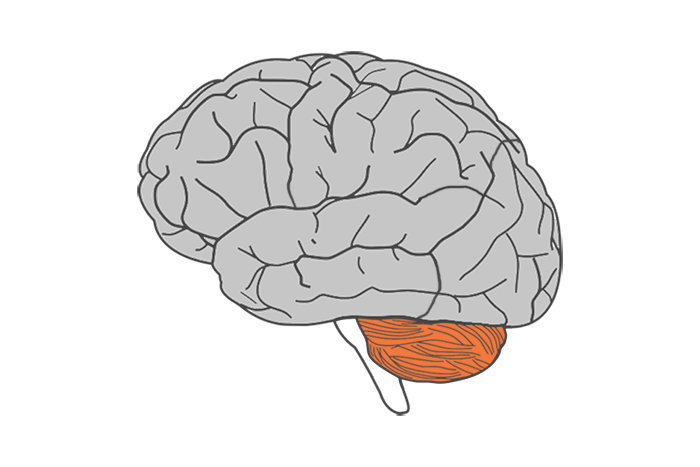

<html>
<style>
details > summary {
  padding: 4px;
  font-size: 20px;
  font-weight: bold;
  width: 600px;
  border: none;
  cursor: pointer;
}

details > p {
  background-color: #eeeeee;
  padding: 4px;
  margin: 0;
  box-shadow: 1px 1px 2px #bbbbbb;
}
</style>
<body>

[Project Home](https://anniegbryant.github.io/DA5030_Final_Project/)

Three datasets in .CSV format were downloaded from the Alzheimer's Disease Neuroimaging Initiative (ADNI) Study Data repository. ADNI data is freely accessible to all registered users. Please see [Acknowledgments](https://anniegbryant.github.io/DA5030_Final_Project/Pages/Acknowledgments.html) for more information about ADNI and its contributors.

<details>
  <summary>Tau-PET Data</summary>
  
Longitudinal **18F-AV-1451 tau-PET data** was downloaded from Study Data/Imaging/PET Image Analysis/UC Berkeley - AV1451 Analysis [ADNI2,3] (version: 5/12/2020). This CSV file contains 1,121 rows and 241 columns. 

Each row represents one tau-PET scan; some subjects had repeated scans separated by approximately one year, while other subjects had only one scan. Columns include subject information including anonymized subject ID, visit code, and PET exam date. The other columns encode regional volume and tau-PET uptake. Specifically, there are 123 distinct cortical and subcortical regions of interest (ROIs), each of which has a volume field (in mm^3) and a tau-PET uptake field, called the Standardized Uptake Value Ratio (SUVR). 

```{r, echo=F, out.width = "300px"}

```

The SUVR value is normalized to the tau-PET uptake in the inferior cerebellum gray matter (highlighted in orange above), a commonly-used region for tau normalization given the lack of inferior cerebellar tau pathology in Alzheimer's Disease. 

**create figure about tauPET/freesurfer/rois**

These 123 ROIs were delineated by first co-registering the tau-PET image to a high-resolution structural T1-weighted MPRAGE acquired in the same imaging session, and then applying FreeSurfer (v5.3) for automated regional segmentation and parcellation. Furthermore, to mitigate issues with lower voxel resolution in PET imaging, partial volume correction was applied to use probabilistic tissue segmentation maps to refine individual ROIs. Note: these PET processing steps were all performed by Susan Landau, Deniz Korman, and William Jagust at the Helen Wills Neuroscience Institute, UC Berkeley and Lawrence Berkeley National Laboratory.

</details>


<details>
  <summary>Alzheimer's Disease Assessment Scale-13 Data</summary>
  
Longitudinal Alzheimer's Disease Assessment Scale-13 (ADAS13) cognitive score data was downloaded from Study Data/Assessments/Neuropsychological/Alzheimer's Disease Assessment Scale (ADAS) [ADNIGO,2,3]. This CSV file contains 6,695 rows and 121 columns. Each row represents one clinical visit; most subjects had two or more clinical visits separated by approximately six months to one year each.

The ADAS rating metric was originally created in 1984 to evaluate cognitive dysfunction specifically in Alzheimer's Disease (Rosen et al. 1984). Since its inception, ADAS has been adapted through several iterations to apply to individuals across the cognitive spectrum (Skinner et al. 2012). Namely, the ADAS-modified includes an additional delayed free recall task and a number cancellation task, thus comprising 13 subscales for scoring (Mohs et al. 1997). This yields a total score ranging from 0 to 70; a score of 0 reflects no cognitive impairment, while a score of 70 indicates severe cognitive impairment. There are multiple columns per individual ADAS component, indicating information such as cognitive task assessed, time to complete the task, and task completion score. There are also columns pertaining to subject/visit information, such as anonymized subject ID, visit code, site ID, ADNI project phase, and exam date.

Sources: 

Rosen, W. G., Mohs, R. C., & Davis, K. L. (1984). A new rating scale for Alzheimer's disease. The American journal of psychiatry. 
Mohs, R. C., Knopman, D., Petersen, R. C., Ferris, S. H., Ernesto, C., Grundman, M., ... & Thal, L. J. (1997). Development of cognitive instruments for use in clinical trials of antidementia drugs: additions to the Alzheimer's Disease Assessment Scale that broaden its scope. Alzheimer disease and associated disorders.
Skinner, J., Carvalho, J. O., Potter, G. G., Thames, A., Zelinski, E., Crane, P. K., ... & Alzheimer’s Disease Neuroimaging Initiative. (2012). The Alzheimer’s disease assessment scale-cognitive-plus (ADAS-Cog-Plus): an expansion of the ADAS-Cog to improve responsiveness in MCI. Brain imaging and behavior, 6(4), 489-501.

</details> 


<details>
  <summary>General Cognitive Status Data</summary>
  
The general cognitive status and cognitive diagnosis dataset was downloaded from Study Data/Assessments/Diagnosis/Diagnostic Summary [ADNI1,GO,2,3]. This CSV file contains 12,268 rows and 54 columns. Certain columns only pertain to certain subsets of the data depending on the project cohort (ADNI1, ADNI-GO, ADNI2, or ADNI3). There are columns for subject/visit information such as anonymized subject ID, ADNI project phase, and exam date, and the rest of the columns indicate cognitive diagnosis information such as probability of dementia due to AD, current cognitive diagnosis, and change in cognitive status from the previous visit. These metrics were all evaluated by neurologists.

</details>


<html>
<style>
details > summary {
  padding: 4px;
  font-size: 10px;
  width: 600px;
  border: none;
  cursor: pointer;
}

details > p {
  padding: 4px;
  margin: 0;
}
</style>
<body>


#### Data Loading & Exploration

<details>
  <summary>View packages used</summary>
  
```{r}
library(tidyverse)
library(knitr)
library(kableExtra)
library(plotly)
library(lubridate)
library(forcats)
```

</details>

#### Load tau-PET data, as downloaded from ADNI:
```{r}
tau.df <- read.csv("../../ADNI_Data/Raw_Data/UCBERKELEYAV1451_PVC_05_12_20.csv")
str(tau.df)
```


#### Scan date distribution

18F-AV-1451 is a relatively recent PET tracer, and was only incorporated into the ADNI-3 pipeline beginning in 2016. I am curious about the temporal distribution of the FreeSurfer-analyzed scans here:

<details>
  <summary>Code</summary>
```{r}
tau.df %>%
  select(RID, EXAMDATE) %>%
  mutate(Scan_Date = as.Date(EXAMDATE, format="%m/%d/%Y")) %>%
  plot_ly(x=~Scan_Date, type="histogram") %>%
  layout(title = 'Tau-PET Scan Date Distribution',
         xaxis = list(title = 'Scan Date',
                      zeroline = TRUE),
         yaxis = list(title = 'Number of PET Scans')) 
```
</details>

#### Number of PET scans per subject 

Since this project will explore tau-PET measurements over time, I will be refining the dataset to only subjects with multiple tau-PET scans. Here's the overall distribution of number of longitudinal scans by subject: 

<details>
  <summary>Code</summary>
```{r}
p_num_long <- og_tau %>%
  mutate(RID=as.character(RID)) %>%
  group_by(RID) %>%
  summarise(n_scans=n()) %>%
  ggplot(., aes(x=fct_reorder(RID, n_scans, .desc=T), y=n_scans)) +
  geom_bar(stat="identity", aes(fill=n_scans, color=n_scans)) +
  labs(fill="Count", color="Count") +
  ggtitle("Number of Longitudinal PET Scans per Subject") +
  ylab("Number of PET Scans") +
  xlab("Subject") +
  theme(axis.text.x=element_blank(),
        plot.title=element_text(hjust=0.5)) 

ggplotly(p_num_long)
```
</details>


