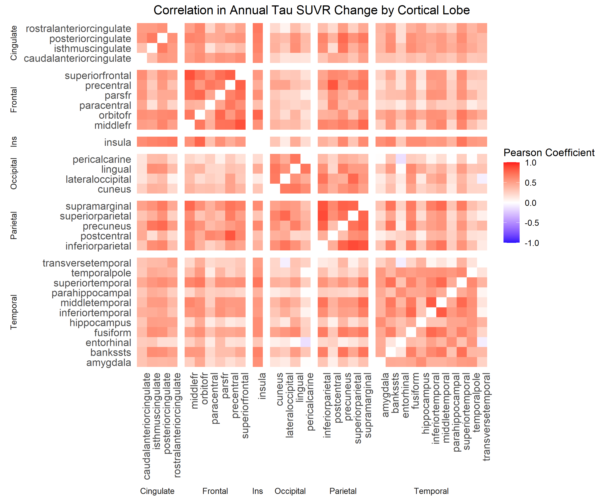
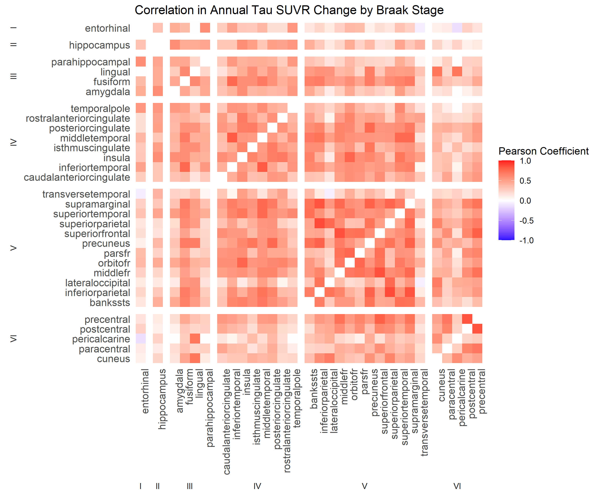

<script src="../hideOutput.js"></script>

```{r setup, include=FALSE}
knitr::opts_chunk$set(echo = TRUE, warning=F, message=F)
```


All packages used to for analysis and figures in this page:

<div class="fold s">
```{r}
library(tidyverse)
library(knitr)
library(kableExtra)
library(plotly)
library(DT)
library(ggcorrplot)
library(psych)
library(GGally)
library(gridExtra)
library(factoextra)
library(FactoMineR)

# remotes::install_github("LCBC-UiO/ggseg")
# 
# If that doesn't work: 
# 
# download.file("https://github.com/LCBC-UiO/ggseg/archive/master.zip", "ggseg.zip")
# unzip("ggseg.zip")
# devtools::install_local("ggseg-master")
library(ggseg)

# remotes::install_github("LCBC-UiO/ggseg3d")
library(ggseg3d)

# remotes::install_github("LCBC-UiO/ggsegExtra")
library(ggsegExtra)
```
</div>

First, I'll load the partial volume-corrected regional tau-PET data from ADNI. For more info on this dataset, please see [Data Understanding](https://anniegbryant.github.io/DA5030_Final_Project/Pages/2_Data_Understanding.html) and [Acknowledgments](https://anniegbryant.github.io/DA5030_Final_Project/Pages/Acknowledgments.html).

<div class="fold s">
```{r}
tau.df <- read.csv("../../ADNI_Data/Raw_Data/UCBERKELEYAV1451_PVC_05_12_20.csv", stringsAsFactors = T)
tau.df$EXAMDATE <- as.Date(as.character(tau.df$EXAMDATE), format="%m/%d/%Y")
```

</div>


Overview of the tau dataset using `str`:
<div class="fold o">
```{r}
str(tau.df)
```
</div>


I'll filter this tau-PET data to contain only subjects with 2+ tau-PET scans, and omit irrelevant columns: 
<div class="fold o s">
```{r}
tau.df <- tau.df %>%
  select(-VISCODE, -update_stamp, -HEMIWM_SUVR, -BRAAK12_SUVR,
         -BRAAK34_SUVR, -BRAAK56_SUVR, -OTHER_SUVR) %>%
  select(!matches("VOLUME")) %>%
  group_by(RID) 

colnames(tau.df) <- str_replace_all(colnames(tau.df), "_SUVR", "")
str(tau.df)
```
</div>


As shown in [Data Understanding](https://anniegbryant.github.io/DA5030_Final_Project/Pages/2_Data_Understanding.html#htmlwidget-aee61fc0845b1248fae6), the ROIs are not precisely standardized to the inferior cerebellum gray matter SUVR. I will re-standardize each region's ROI SUVR values here.


<div class="fold s">
```{r}
tau.stand <- tau.df
for (i in 4:ncol(tau.stand)) {
  tau.stand[i] <- tau.stand[i]/ tau.df[4]
}
rm(tau.df)
```
</div>

Standardization can be verified using `summary`:
```{r}
summary(tau.stand$INFERIOR_CEREBGM)
```

Now that regional SUVR is properly standardized, the next step is to select brain regions based on *a priori* knowledge of where and how tau affects the brain in MCI/AD. I am going to stratify the cortical parcellations and subcortical segmentations based on Schöll et al. [(2016)](https://www.ncbi.nlm.nih.gov/pmc/articles/PMC4779187/) and per UCSF's recommendations for usage of their tau-PET data. Here is the stratification across the Braak stages:

<div class="fold s">

```{r}
roi.braak <- read.csv("roi_braak_stages.csv") %>% mutate(ROI_Name = tolower(ROI_Name)) %>%
  mutate(Hemisphere = ifelse(str_detect(ROI_Name, "rh_|right"), "Right", "Left"))
datatable(roi.braak %>% select(-Base_Name))
```

</div>

The following plots show the spatial relationship of the Braak stages in the brain, in the cortical (top) and subcortical (bottom) ROIs:

<div class="fold s">
```{r, results='hold'}
ggseg.aparc <- read_excel("ggseg_roi.xlsx", sheet=1) %>%
  mutate(Braak=as.numeric(as.roman(Braak)))

ggseg.aseg <- read_excel("ggseg_roi.xlsx", sheet=2) %>%
  mutate(Braak=as.numeric(as.roman(Braak)))

myfont <- list(
  family = "sans",
  size = 14)

p1 <- data.frame(region=ggseg.aparc$ggseg_ROI, 
                 Braak=as.character(ggseg.aparc$Braak), stringsAsFactors = F) %>%
  ggseg(atlas="dk", mapping=aes(fill=Braak, label=region)) +
  scale_fill_discrete(breaks = c("1", "3", "4", "5", "6")) +
  theme(axis.text.y=element_blank(),
        axis.text.x = element_text(family="calibri"),
        axis.title.x = element_text(family="calibri"),
        legend.title=element_text(family="calibri"),
        legend.text=element_text(family="calibri"))
ggplotly(p1, tooltip = c("fill", "label"), width=800, height=300)

p2 <- data.frame(region=ggseg.aseg$ggseg_ROI,
  Braak=as.character(ggseg.aseg$Braak), stringsAsFactors = F) %>%
  ggseg(atlas="aseg", mapping=aes(fill=Braak, label=region)) +
  scale_fill_discrete(breaks = c("2", "3")) +
  theme(axis.text.y=element_blank(),
        axis.text.x = element_text(family="calibri"),
        axis.title.x = element_text(family="calibri"),
        legend.title=element_text(family="calibri"),
        legend.text=element_text(family="calibri"))
ggplotly(p2, tooltip=c("fill", "label"), width=800, height=300)
```
</div>


I will filter the tau-PET dataset to only include SUVR data for ROIs detailed in the above list, by first reshaping the tau-PET SUVR data from wide to long. Then, I will merge left and right hemisphere ROIs into one bilateral ROI by taking the mean SUVR.

<div class="fold o s">

```{r}
tau.stand.roi <- tau.stand %>%
  pivot_longer(., cols=c(-RID, -VISCODE2, -EXAMDATE), names_to="ROI_Name", values_to="SUVR") %>%
  mutate(ROI_Name=tolower(ROI_Name)) %>%
  semi_join(., roi.braak) %>%
  left_join(., roi.braak) %>%
  mutate(ROI_Name = str_replace_all(ROI_Name, "right_|left_|ctx_rh_|ctx_lh_", "")) %>%
  dplyr::group_by(RID, VISCODE2, EXAMDATE, ROI_Name, Braak) %>%
  dplyr::summarise(SUVR = mean(SUVR, na.rm=T))
```

</div>

This yields the following 31 distinct cortical ROIs:
<div class="fold s">
```{r}
data.frame(ROI=unique(tau.stand.roi$ROI_Name)) %>%
  left_join(., roi.braak, by=c("ROI"="Base_Name")) %>%
  select(-ROI_Name, -Hemisphere) %>%
  distinct() %>%
  datatable()
```
</div>


Now, I will re-shape the tau-PET data back to wide to be compatible with the cognitive status data shape.

<div class="fold o">
```{r}
tau.stand.roi <- tau.stand.roi %>% 
  select(-Braak) %>%
  pivot_wider(id_cols=c(RID, VISCODE2, EXAMDATE), names_from="ROI_Name",
              values_from="SUVR")

str(tau.stand.roi)
```
</div>


ADNI compiled a merged dataset containing key information from several tables, including subject demographics, selected cognitive assessment scores, and select biomarker data.


I am interested in the following features in this dataset:

* `RID`: Participant roster ID, which serves as unique subject identifier 
* `VISCODE`: Visit code
* `EXAMDATE`: Date
* `AGE`: Age at visit
* `PTGENDER`: Biological sex
* `CDRSB`: CDR Sum-of-Boxes score at visit
* `DX`: Current cognitive diagnosis

```{r}
subj.info <- read.csv("../../ADNI_Data/Raw_Data/ADNIMERGE.csv", stringsAsFactors = T, na.strings="")
subj.info <- subj.info %>% select(RID, VISCODE, AGE, PTGENDER, CDRSB, DX)
```


I actually can't join the two datasets on the EXAMDATE feature, as these sometimes differ by one or two days depending on when the records were entered. Instead, I will join by the RID subject identifier and VISCODE, a visit code identifier.
```{r}
full.df <- inner_join(tau.stand.roi, subj.info, by=c("RID", "VISCODE2"="VISCODE"))  %>%
  filter(!is.na(CDRSB)) %>%
  group_by(RID) %>%
  dplyr::mutate(n_visits = n()) %>%
  filter(n_visits>1) %>%
  select(-n_visits)
```


Click to see the structure of this merged dataset:

<div class="fold o">
```{r}
str(full.df)
```
</div>


<div class="fold s">
```{r, results='asis'}
cat("\nNumber of longitudinal tau-PET scans with accompanying cognitive data: **\n",
    nrow(full.df), "**\nNumber of subjects in merged dataset: **", 
    length(unique(full.df$RID)), "**\n", "\n", sep="")
```
</div>

As it turns out, only 588 of the original 593 tau-PET scans had corresponding cognitive assessments. This leaves 576 unique PET scan datapoints for 243 subjects.  


Lastly, before I can perform outlier detection, I need to derive the longitudinal features upon which the prediction models will be built -- namely, annual change in tau-PET SUVR and annual change in CDR-Sum of Boxes score.

<div class="fold s">
```{r}
annual.changes <- full.df %>%
  ungroup() %>%
  select(-AGE, -PTGENDER, -DX, -VISCODE2) %>%
  pivot_longer(cols=c(-RID, -EXAMDATE), names_to="Metric",
               values_to="Value") %>%
  dplyr::group_by(RID, Metric) %>%
  dplyr::summarise(n_years = as.numeric((EXAMDATE - lag(EXAMDATE, 
                                                        default=EXAMDATE[1]))/365),
                   change = Value - lag(Value, default=Value[1])) %>%
  filter(n_years > 0) %>%
  dplyr::mutate(Annual_Change = change/n_years) %>%
  select(-n_years, -change) %>%
  group_by(RID, Metric) %>%
  dplyr::mutate(interval_num = row_number()) %>%
  pivot_wider(., id_cols=c(RID, interval_num), names_from=Metric,
              values_from=Annual_Change)
datatable(annual.changes[1:5])
```
</div>


Now that the datasets are merged, I can perform outlier detection. Given the multivariate nature of this dataset (i.e. multiple brain regions), I will use Cook's Distance to estimate the relative influence of each data point in a simple multiple regression model.


<div class="fold s">

```{r, results='hold'}
cooks.distance <- cooks.distance(lm(CDRSB ~ . - RID - interval_num, data=annual.changes))

p.cooks <- data.frame(CD=cooks.distance) %>%
  rownames_to_column(var="Data_Point") %>%
  mutate(Data_Point=as.numeric(Data_Point)) %>%
  mutate(Label=ifelse(CD>30, Data_Point, NA_real_)) %>%
  ggplot(data=., mapping=aes(x=Data_Point,y=CD)) +
  geom_hline(yintercept = 4*mean(cooks.distance,na.rm=T), color="blue") +
  geom_point() +
  geom_text(aes(label=Label), nudge_y=1.5) +
  ylab("Cook's Distance") +
  xlab("annual.changes index") +
  theme_minimal()

ggplotly(p.cooks)
rm(p.cooks)
```

</div>


All but one data point have relatively low Cook's distance values, while data point #224 has a relatively large Cook's distance. This suggests large residuals and leverage associated with this datapoint, which could distort model fitting and accuracy. Upon further examination of this instance:  


<div class="fold s">
```{r}
as.data.frame(t(annual.changes[224,])) %>%
  rownames_to_column(var="Variable") %>%
  dplyr::rename("Value" = "V1") %>%
  datatable()
```
</div>


This subject exhibits very large fluctuations in tau-PET SUVR values in several brain regions for this associated time interval. Given that SUVR values typically range from 0.75-2, changes of this large magnitude is surprising, and may certainly render this data point an outlier. Fortunately, the `interval_num` of 2 indicates that this is the second time interval for this subject, so omitting this interval doesn't reduce the total number of subjects in the analysis. I will remove this data point:

```{r}
annual.changes <- annual.changes[-224,]
```


I can now finish some aspects of data exploration that depended upon refining the subject cohort as well as the features. For starters, I will examine the distribution of annual tau change in each of the 26 ROIs:

<div class="fold s">
```{r}
annual.changes.tau <- annual.changes %>%
  select(-CDRSB) %>%
  ungroup() %>%
  pivot_longer(cols=c(-RID, -interval_num), names_to="ROI",
               values_to="deltaSUVR")

multi.hist(annual.changes %>% ungroup() %>% select(-RID, -interval_num, -CDRSB),
           dcol="red")
```
</div>


The distribution looks reasonably normal for each ROI, and all of the curves peak around zero, suggesting all of the ROIs have a mean of ~0. Since there are both negative values and values of zero in these data, neither log nor square root transformation would be possible, anyway. Therefore, I will leave the variable distribution as-is.


Next, I will visualize the correlation in annual tau change between each of the ROIs measured:

<div class="fold s">

```{r}
annual.roi <- annual.changes %>% ungroup() %>% select(-RID, -interval_num, -CDRSB)
roi.cor <- cor(annual.roi)
p.mat <- cor_pmat(annual.roi)

ggcorrplot(roi.cor, hc.order = TRUE, 
           outline.col = "white") %>% ggplotly(width=800, height=700)
```
</div>


As it turns out, all ROIs show positive correlations in the annual rate of change in tau-PET uptake, with the exception of three ROI pairs: 

* entorhinal and pericalcarine (R=-0.14) 
* entorhinal and transverse temporal (R=-0.07) 
* transverse temporal and lateral occipital (R=-0.07)

These are very weak correlations, and can be further visualized with scatter plots:

<div class="fold s">
```{r}
p.select.rois <- ggpairs(annual.roi %>% select(entorhinal, pericalcarine, transversetemporal,
                                               lateraloccipital),
                         lower = list(continuous = wrap("smooth", se=F, 
                                                        method = "lm", color="lightslategray",
                                                        alpha=0.4))) +
  theme_minimal()
ggplotly(p.select.rois, width=700, height=600)
```
</div>

These negative correlations are indeed weak and mostly noise, based on the scatter plots. Regarding the other positive correlations, I am curious as to whether there are underlying trends based on either spatial proximity and/or tau progression in AD, based on cortical lobe and Braak regions, respectively:

<div class="fold s">

```{r, results='hold', out.width='80%', out.height='80%'}
roi.cor.long <-  as.data.frame(roi.cor) %>%
  rownames_to_column(var="ROI1") %>%
  pivot_longer(cols=c(-ROI1), names_to="ROI2", values_to="Pearson_Corr") %>%
  filter(ROI1 != ROI2) %>%
  left_join(., roi.braak, by=c("ROI1"="Base_Name")) %>%
  select(-ROI_Name, -Hemisphere) %>%
  dplyr::rename("ROI1_Braak" = "Braak", "ROI1_Cortex" = "Cortex") %>%
  left_join(., roi.braak, by=c("ROI2" = "Base_Name")) %>%
  select(-ROI_Name, -Hemisphere) %>%
  dplyr::rename("ROI2_Braak" = "Braak", "ROI2_Cortex" = "Cortex") %>%
  mutate_at(c("ROI1_Cortex", "ROI2_Cortex"), function(x) ifelse(x=="Insula", "Ins", x))

p.cor.cortical <- roi.cor.long %>%
  ggplot(., mapping=aes(x=ROI1, y=ROI2)) +
  geom_tile(mapping=aes(fill=Pearson_Corr)) +
  labs(fill="Pearson Coefficient") +
  theme_minimal() +
  facet_grid(ROI2_Cortex ~ ROI1_Cortex, scales="free", 
             space="free", switch="both") +
  ggtitle("Correlation in Annual Tau SUVR Change by Cortical Lobe") +
  theme(axis.title=element_blank(),
        axis.text.y = element_text(size=11),
        axis.text.x = element_text(angle=90, size=11, hjust=1),
        panel.border = element_blank(), 
        panel.grid = element_blank(),
        plot.title=element_text(hjust=0.5)) +
  theme(strip.placement = "outside") +
  scale_fill_gradient2(low="#210DFC", mid="white", high="#FF171B",
                       limits=c(-1,1))
ggsave("ROI_Correlation_Cortical.png", plot=p.cor.cortical, width=9, height=7.5, units="in", dpi=300)

```
</div>

There are somewhat stronger inter-correlations within the frontal and parietal cortices compared with other cortical lobes. Now stratifying based on ROI Braak stage:

<div class="fold s">

```{r, results='hold', out.width='80%', out.height='80%'}
p.cor.braak <- roi.cor.long %>%
  ggplot(., mapping=aes(x=ROI1, y=ROI2)) +
  geom_tile(mapping=aes(fill=Pearson_Corr)) +
  labs(fill="Pearson Coefficient") +
  theme_minimal() +
  facet_grid(ROI2_Braak ~ ROI1_Braak, scales="free", 
             space="free", switch="both") +
  ggtitle("Correlation in Annual Tau SUVR Change by Braak Stage") +
  theme(axis.title=element_blank(),
        axis.text.y = element_text(size=11),
        axis.text.x = element_text(angle=90, size=11, hjust=1),
        panel.border = element_blank(), 
        panel.grid = element_blank()) +
  theme(strip.placement = "outside") +
  scale_fill_gradient2(low="#210DFC", mid="white", high="#FF171B",
                       limits=c(-1,1))

ggsave("ROI_Correlation_Braak.png", plot=p.cor.braak, width=9, height=7.5, units="in", dpi=300)

```

</div>

&nbsp; 

This generally high correlation in annual tau-PET SUVR changes between cortical regions may pose a challenge when it comes to modeling, because of feature collinearity. While I want to keep each region distinct for biological context, I will also reduce the dimensionality of the data using principal component analysis (PCA), which has an added benefit of yielding orthogonal un-correlated components to serve as input for the modeling phase. Since all the variables are in the same unit (i.e. change in SUVR per year), I will only need to center the data, not scale it.


<div class="fold s">

```{r}
pca.df <- as.matrix(annual.changes %>% ungroup() %>% select(-RID, -CDRSB, -interval_num))
res.pca <- prcomp(pca.df, center=T, scale.=F)
# The variable info can be extracted as follows:
var <- get_pca_var(res.pca)
```

</div>

The proportion of variance explained by each principal component (PC) can be visualized using a Scree plot:

<div class="fold s">

```{r, results='hold'}
cumpro <- cumsum(res.pca$sdev^2 / sum(res.pca$sdev^2)*100)
variances <- data.frame((res.pca$sdev^2/sum(res.pca$sdev^2))*100)
variances$PC <- c(1:31)
variances$cumpro <- cumpro
colnames(variances) <- c("Variance_Proportion", "PC", "CumVar")

newrow <- subset(variances, PC == 31)
newrow$PC <- 31.5
variances <- plyr::rbind.fill(variances, newrow)

linecolors <- c("Component Variance" = "maroon4",
                "Cumulative Variance" = "green4")

p.var <- variances %>%
  ggplot(data=.) +
  geom_bar(data=subset(variances, PC < 32), mapping=aes(x=PC, y=Variance_Proportion),
           stat="identity", fill="steelblue") +
  geom_line(aes(color="Component Variance", x=PC, y=Variance_Proportion), 
            size=0.7, data=subset(variances, PC < 31.1), show.legend=F) +
  geom_line(aes(x=PC, y=CumVar, color="Cumulative Variance"), size=0.7,
            data=subset(variances, PC < 32)) +
  geom_point(aes(x=PC, y=Variance_Proportion),data=subset(variances, PC < 31.1), size=1.5) +
  scale_colour_manual(name="",values=linecolors, 
                      guide = guide_legend(override.aes=list(size=2))) + 
  theme_minimal() +
  ylab("Percentage of Variance Explained") +
  xlab("Principal Component") +
  ggtitle("Principal Components\nContribution to Subject Variance") +
  xlim(c(0.5, 31.5)) +
  scale_y_continuous(breaks=seq(0, 100, 10),
                     sec.axis = dup_axis(name="")) +
  theme(plot.title = element_text(hjust=0.5, size=14),
        axis.text = element_text(size=12),
        panel.grid = element_blank(),
        legend.position="bottom",
        legend.text = element_text(size=12))

ggplotly(p.var, tooltip=c("x","y")) %>% 
  layout(legend = list(orientation = "h", y=-0.2))
```
</div>

The first five principal components (PCs) collectively explain 77.2% of variance in the data; beyond these components, there are only marginal increases in the cumulative variance explained. Therefore, I will move forward with these first five PCs.

Individual ROI contributions (loadings) per component can be extracted:

<div class="fold s">
```{r}
loadings_wide <- data.frame(res.pca$rotation) %>%
  cbind(rownames(.), .) %>%
  remove_rownames() %>% 
  dplyr::rename("ROI" = "rownames(.)") %>%
  select(ROI:PC5) %>%
  rowwise() %>%
  left_join(., roi.braak, by=c("ROI"="Base_Name")) %>%
  select(ROI, Cortex, Braak, PC1:PC5) %>%
  distinct()

datatable(loadings_wide %>% mutate_if(is.numeric, function(x) round(x,4)))
```
</div>

I'm curious as to whether ROIs exhibit similar covariance in annual tau-PET changes based on spatial proximity (i.e. cortical region) and/or similar Alzheimer's Disease progression (i.e. Braak stage).

<div class="fold s">
```{r, results='hold'}
p.cortex <- loadings_wide %>%
  ggplot(data=., mapping=aes(x=PC1, y=PC2, label=ROI)) +
  geom_hline(yintercept=0, linetype=2, alpha=0.5) +
  geom_vline(xintercept=0, linetype=2, alpha=0.5) +
  geom_point(aes(color=Cortex), size=3) +
  theme_minimal() +
  xlab("PC1 (41.6% Variance)") +
  ylab("PC2 (14.0% Variance)") +
  ggtitle("ROI PC Loadings by Cortical Region") +
  theme(plot.title=element_text(hjust=0.5))

ggplotly(p.cortex, tooltip=c("label", "x", "y"))
rm(p.cortex)
```
</div>

The first note is that all of the ROIs exhibit a negative loading (correlation) with PC1. Beyond that, all of the occipital and parietal cortex ROIs are positively correlated with PC2, while the insula, temporal cortex, and cingulate cortex ROIs are all negatively correlated with PC2. The frontal cortex ROIs are right on the border of PC2, low correlations in both directions.

<div class="fold s">
```{r, results='hold'}
library(ggrepel)
p.braak <- loadings_wide %>%
  ggplot(data=., mapping=aes(x=PC1, y=PC2, label=ROI)) +
  geom_hline(yintercept=0, linetype=2, alpha=0.5) +
  geom_vline(xintercept=0, linetype=2, alpha=0.5) +
  geom_point(aes(color=Braak), size=3) +
  theme_minimal() +
  xlab("PC1 (41.6% Variance)") +
  ylab("PC2 (14.0% Variance)") +
  ggtitle("ROI PC Loadings by Braak Stage") +
  theme(plot.title=element_text(hjust=0.5))

ggplotly(p.braak, tooltip=c("label", "x", "y"))
rm(p.braak)
```

</div>

There is not as clear a distinction to be made based on ROI Braak stage. One observation that does stand out is that all of the Braak VI ROIs are relatively close in the upper right of the points. Beyond that, the Braak stages are mixed in this loading plot.  

Moving on, the subject and time interval info can be linked with the PCA results:

<div class="fold s">
```{r}
post.pca <- as.data.frame(res.pca$x[,1:5]) %>%
  cbind(., RID=annual.changes$RID) %>%
  cbind(., interval_num=annual.changes$interval_num) %>%
  cbind(., CDRSB=annual.changes$CDRSB) %>%
  select(RID, interval_num, CDRSB, PC1:PC5)

datatable(post.pca %>% mutate_if(is.numeric, function(x) round(x,5)))
```
</div>


I'll save these prepared datasets to an .RData file for modeling:
```{r}
save(annual.changes, subj.info, post.pca, file="../Prepared_Data.RData")
```

