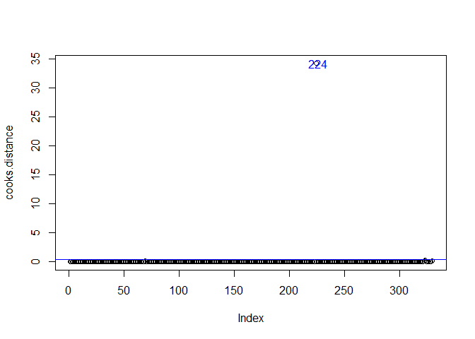

<html>
<style>
details > summary {
padding: 4px;
font-size: 16px;
font-weight: bold;
width: 600px;
border: none;
cursor: pointer;
}

ul {
background-color: #eeeeee;
padding: 4px;
margin: 4;
box-shadow: 1px 1px 2px #bbbbbb;
}

details > p {
background-color: #eeeeee;
padding: 4px;
margin: 0;
box-shadow: 1px 1px 2px #bbbbbb;
}
</style>
<body>


<script src="hideOutput.js"></script>


Packages used to create the below figures:


```r
library(tidyverse)
library(knitr)
library(kableExtra)
library(plotly)
library(lubridate)
library(readxl)
library(DT)
library(ggcorrplot)
```


Load partial volume corrected regional tau-PET data, as downloaded from ADNI:

```r
tau.df <- read.csv("../../ADNI_Data/Raw_Data/UCBERKELEYAV1451_PVC_05_12_20.csv", stringsAsFactors = T)
tau.df$EXAMDATE <- as.Date(as.character(tau.df$EXAMDATE), format="%m/%d/%Y")
```


Filter tau data to contain only subjects with 2+ tau-PET scans, and omit irrelevant columns:

```r
tau.df <- tau.df %>%
  select(-VISCODE, -update_stamp, -HEMIWM_SUVR, -BRAAK12_SUVR,
         -BRAAK34_SUVR, -BRAAK56_SUVR, -OTHER_SUVR) %>%
  select(!matches("VOLUME")) %>%
  group_by(RID) 

colnames(tau.df) <- str_replace_all(colnames(tau.df), "_SUVR", "")
```


As shown in [Data Understanding](https://anniegbryant.github.io/DA5030_Final_Project/Pages/2_Data_Understanding.html#htmlwidget-aee61fc0845b1248fae6), the ROIs are not precisely standardized to the inferior cerebellum gray matter SUVR. I will re-standardize the ROI SUVR values here:


```r
tau.stand <- tau.df
for (i in 4:ncol(tau.stand)) {
  tau.stand[i] <- tau.stand[i]/ tau.df[4]
}
rm(tau.df)
```


The next step is to select brain regions *a priori*. I am going to stratify the cortical parcellations and subcortical segmentations based on Schöll et al. [(2016)](https://www.ncbi.nlm.nih.gov/pmc/articles/PMC4779187/) and per UCSF's recommendations for usage of their tau-PET data. Here is the stratification across the Braak stages:

<div class="fold s">


```r
roi.braak <- read.csv("roi_braak_stages.csv") %>% mutate(ROI_Name = tolower(ROI_Name)) %>%
  mutate(Hemisphere = ifelse(str_detect(ROI_Name, "rh_|right"), "Right", "Left"))
datatable(roi.braak)
```

<!--html_preserve--><div id="htmlwidget-79b1028d2cdbec70f0da" style="width:100%;height:auto;" class="datatables html-widget"></div>
<script type="application/json" data-for="htmlwidget-79b1028d2cdbec70f0da">{"x":{"filter":"none","data":[["1","2","3","4","5","6","7","8","9","10","11","12","13","14","15","16","17","18","19","20","21","22","23","24","25","26","27","28","29","30","31","32","33","34","35","36","37","38","39","40","41","42","43","44","45","46","47","48","49","50","51","52","53","54","55","56","57","58","59","60","61","62","63","64","65","66","67","68","69","70","71","72"],["ctx_lh_entorhinal","ctx_rh_entorhinal","left_hippocampus","right_hippocampus","ctx_lh_parahippocampal","ctx_rh_parahippocampal","ctx_lh_fusiform","ctx_rh_fusiform","ctx_lh_lingual","ctx_rh_lingual","ctx_lh_amygdala","ctx_rh_amygdala","ctx_lh_middle_temporal","ctx_rh_middle_temporal","ctx_lh_caudalanteriorcingulate","ctx_rh_caudalanteriorcingulate","ctx_lh_rostralanteriorcingulate","ctx_rh_rostralanteriorcingulate","ctx_lh_posteriorcingulate","ctx_rh_posteriorcingulate","ctx_lh_isthmuscingulate","ctx_rh_isthmuscingulate","ctx_lh_insula","ctx_rh_insula","ctx_lh_inferiortemporal","ctx_rh_inferiortemporal","ctx_lh_temporalpole","ctx_rh_temporalpole","ctx_lh_superiorfrontal","ctx_rh_superiorfrontal","ctx_lh_lateralorbitofrontal","ctx_rh_lateralorbitofrontal","ctx_lh_medialorbitofrontal","ctx_rh_medialorbitofrontal","ctx_lh_frontalpole","ctx_rh_frontalpole","ctx_lh_caudalmiddlefrontal","ctx_rh_caudalmiddlefrontal","ctx_lh_parsopercularis","ctx_rh_parsopercularis","ctx_lh_parsorbitalis","ctx_rh_parsorbitalis","ctx_lh_parstriangularis","ctx_rh_parstriangularis","ctx_lh_lateraloccipital","ctx_rh_lateraloccipital","ctx_lh_supramarginal","ctx_rh_supramarginal","ctx_lh_inferior_parietal","ctx_rh_inferior_parietal","ctx_lh_superiortemporal","ctx_rh_superiortemporal","ctx_lh_superiorparietal","ctx_rh_superiorparietal","ctx_lh_precuneus","ctx_rh_precuneus","ctx_lh_bankssts","ctx_rh_bankssts","ctx_lh_transversetemporal","ctx_rh_transversetemporal","ctx_lh_rostralmiddlefrontal","ctx_rh_rostralmiddlefrontal","ctx_lh_pericalcarine","ctx_rh_pericalcarine","ctx_lh_postcentral","ctx_rh_postcentral","ctx_lh_precentral","ctx_rh_precentral","ctx_lh_paracentral","ctx_rh_paracentral","ctx_lh_cuneus","ctx_rh_cuneus"],["I","I","II","II","III","III","III","III","III","III","III","III","IV","IV","IV","IV","IV","IV","IV","IV","IV","IV","IV","IV","IV","IV","IV","IV","V","V","V","V","V","V","V","V","V","V","V","V","V","V","V","V","V","V","V","V","V","V","V","V","V","V","V","V","V","V","V","V","V","V","VI","VI","VI","VI","VI","VI","VI","VI","VI","VI"],["Left","Right","Left","Right","Left","Right","Left","Right","Left","Right","Left","Right","Left","Right","Left","Right","Left","Right","Left","Right","Left","Right","Left","Right","Left","Right","Left","Right","Left","Right","Left","Right","Left","Right","Left","Right","Left","Right","Left","Right","Left","Right","Left","Right","Left","Right","Left","Right","Left","Right","Left","Right","Left","Right","Left","Right","Left","Right","Left","Right","Left","Right","Left","Right","Left","Right","Left","Right","Left","Right","Left","Right"]],"container":"<table class=\"display\">\n  <thead>\n    <tr>\n      <th> <\/th>\n      <th>ROI_Name<\/th>\n      <th>Braak<\/th>\n      <th>Hemisphere<\/th>\n    <\/tr>\n  <\/thead>\n<\/table>","options":{"order":[],"autoWidth":false,"orderClasses":false,"columnDefs":[{"orderable":false,"targets":0}]}},"evals":[],"jsHooks":[]}</script><!--/html_preserve-->

</div>

I will filter the tau-PET dataset to only include SUVR data for ROIs detailed in the above list, by first reshaping the tau-PET SUVR data from wide to long. Then, I will merge left and right hemisphere ROIs into one bilateral ROI by taking the mean SUVR.


```r
tau.stand.roi <- tau.stand %>%
  pivot_longer(., cols=c(-RID, -VISCODE2, -EXAMDATE), names_to="ROI_Name", values_to="SUVR") %>%
  mutate(ROI_Name=tolower(ROI_Name)) %>%
  semi_join(., roi.braak) %>%
  left_join(., roi.braak) %>%
  mutate(ROI_Name = str_replace_all(ROI_Name, "right_|left_|ctx_rh_|ctx_lh_", "")) %>%
  group_by(RID, VISCODE2, EXAMDATE, ROI_Name, Braak) %>%
  summarise(SUVR = mean(SUVR, na.rm=T))
```

Now, I will re-shape the data back to wide to be compatible with the cognitive status data shape.

<div class="fold o">

```r
tau.stand.roi <- tau.stand.roi %>% 
  select(-Braak) %>%
  pivot_wider(id_cols=c(RID, VISCODE2, EXAMDATE), names_from="ROI_Name",
              values_from="SUVR")

str(tau.stand.roi)
```

```
## tibble [1,120 x 28] (S3: grouped_df/tbl_df/tbl/data.frame)
##  $ RID                     : int [1:1120] 21 31 31 56 56 56 59 69 69 69 ...
##  $ VISCODE2                : Factor w/ 16 levels "","bl","m108",..: 7 7 8 7 8 9 7 7 8 9 ...
##  $ EXAMDATE                : Date[1:1120], format: "2018-02-02" "2018-04-24" "2019-04-23" "2018-02-20" ...
##  $ bankssts                : num [1:1120] 1.34 1.26 1.23 1.32 1.32 ...
##  $ caudalanteriorcingulate : num [1:1120] 1.29 1.32 1.25 1.35 1.4 ...
##  $ cuneus                  : num [1:1120] 1.81 1.67 1.6 1.62 1.65 ...
##  $ entorhinal              : num [1:1120] 1.54 2.28 2.22 2.07 1.95 ...
##  $ fusiform                : num [1:1120] 1.5 1.38 1.35 1.42 1.4 ...
##  $ hippocampus             : num [1:1120] 1.56 1.52 1.59 1.29 1.36 ...
##  $ inferiortemporal        : num [1:1120] 1.67 1.48 1.45 1.61 1.61 ...
##  $ insula                  : num [1:1120] 1.14 1.22 1.18 1.21 1.18 ...
##  $ isthmuscingulate        : num [1:1120] 1.49 1.38 1.38 1.42 1.51 ...
##  $ lateraloccipital        : num [1:1120] 1.77 1.49 1.46 1.47 1.58 ...
##  $ lingual                 : num [1:1120] 1.66 1.52 1.45 1.42 1.43 ...
##  $ paracentral             : num [1:1120] 1.44 1.35 1.3 1.48 1.48 ...
##  $ parahippocampal         : num [1:1120] 1.18 1.43 1.45 1.39 1.37 ...
##  $ pericalcarine           : num [1:1120] 1.61 1.33 1.29 1.23 1.27 ...
##  $ postcentral             : num [1:1120] 1.49 1.4 1.34 1.43 1.42 ...
##  $ posteriorcingulate      : num [1:1120] 1.37 1.39 1.33 1.33 1.38 ...
##  $ precentral              : num [1:1120] 1.37 1.4 1.33 1.3 1.34 ...
##  $ precuneus               : num [1:1120] 1.43 1.4 1.39 1.43 1.48 ...
##  $ rostralanteriorcingulate: num [1:1120] 1.32 1.21 1.15 1.21 1.2 ...
##  $ superiorfrontal         : num [1:1120] 1.41 1.42 1.34 1.43 1.43 ...
##  $ superiorparietal        : num [1:1120] 1.39 1.5 1.46 1.49 1.52 ...
##  $ superiortemporal        : num [1:1120] 1.53 1.45 1.38 1.46 1.44 ...
##  $ supramarginal           : num [1:1120] 1.41 1.37 1.32 1.41 1.45 ...
##  $ temporalpole            : num [1:1120] 1.71 1.64 1.54 1.54 1.43 ...
##  $ transversetemporal      : num [1:1120] 1.41 1.46 1.37 1.28 1.21 ...
##  - attr(*, "groups")= tibble [1,120 x 4] (S3: tbl_df/tbl/data.frame)
##   ..$ RID     : int [1:1120] 21 31 31 56 56 56 59 69 69 69 ...
##   ..$ VISCODE2: Factor w/ 16 levels "","bl","m108",..: 7 7 8 7 8 9 7 7 8 9 ...
##   ..$ EXAMDATE: Date[1:1120], format: "2018-02-02" "2018-04-24" "2019-04-23" ...
##   ..$ .rows   : list<int> [1:1120] 
##   .. ..$ : int 1
##   .. ..$ : int 2
##   .. ..$ : int 3
##   .. ..$ : int 4
##   .. ..$ : int 5
##   .. ..$ : int 6
##   .. ..$ : int 7
##   .. ..$ : int 8
##   .. ..$ : int 9
##   .. ..$ : int 10
##   .. ..$ : int 11
##   .. ..$ : int 12
##   .. ..$ : int 13
##   .. ..$ : int 14
##   .. ..$ : int 15
##   .. ..$ : int 16
##   .. ..$ : int 17
##   .. ..$ : int 18
##   .. ..$ : int 19
##   .. ..$ : int 20
##   .. ..$ : int 21
##   .. ..$ : int 22
##   .. ..$ : int 23
##   .. ..$ : int 24
##   .. ..$ : int 25
##   .. ..$ : int 26
##   .. ..$ : int 27
##   .. ..$ : int 28
##   .. ..$ : int 29
##   .. ..$ : int 30
##   .. ..$ : int 31
##   .. ..$ : int 32
##   .. ..$ : int 33
##   .. ..$ : int 34
##   .. ..$ : int 35
##   .. ..$ : int 36
##   .. ..$ : int 37
##   .. ..$ : int 38
##   .. ..$ : int 39
##   .. ..$ : int 40
##   .. ..$ : int 41
##   .. ..$ : int 42
##   .. ..$ : int 43
##   .. ..$ : int 44
##   .. ..$ : int 45
##   .. ..$ : int 46
##   .. ..$ : int 47
##   .. ..$ : int 48
##   .. ..$ : int 49
##   .. ..$ : int 50
##   .. ..$ : int 51
##   .. ..$ : int 52
##   .. ..$ : int 53
##   .. ..$ : int 54
##   .. ..$ : int 55
##   .. ..$ : int 56
##   .. ..$ : int 57
##   .. ..$ : int 58
##   .. ..$ : int 59
##   .. ..$ : int 60
##   .. ..$ : int 61
##   .. ..$ : int 62
##   .. ..$ : int 63
##   .. ..$ : int 64
##   .. ..$ : int 65
##   .. ..$ : int 66
##   .. ..$ : int 67
##   .. ..$ : int 68
##   .. ..$ : int 69
##   .. ..$ : int 70
##   .. ..$ : int 71
##   .. ..$ : int 72
##   .. ..$ : int 73
##   .. ..$ : int 74
##   .. ..$ : int 75
##   .. ..$ : int 76
##   .. ..$ : int 77
##   .. ..$ : int 78
##   .. ..$ : int 79
##   .. ..$ : int 80
##   .. ..$ : int 81
##   .. ..$ : int 82
##   .. ..$ : int 83
##   .. ..$ : int 84
##   .. ..$ : int 85
##   .. ..$ : int 86
##   .. ..$ : int 87
##   .. ..$ : int 88
##   .. ..$ : int 89
##   .. ..$ : int 90
##   .. ..$ : int 91
##   .. ..$ : int 92
##   .. ..$ : int 93
##   .. ..$ : int 94
##   .. ..$ : int 95
##   .. ..$ : int 96
##   .. ..$ : int 97
##   .. ..$ : int 98
##   .. ..$ : int 99
##   .. .. [list output truncated]
##   .. ..@ ptype: int(0) 
##   ..- attr(*, ".drop")= logi TRUE
```
</div>


ADNI compiled a merged dataset containing key information from several tables, including subject demographics, selected cognitive assessment scores, and select biomarker data.

```r
subj.info <- read.csv("../../ADNI_Data/Raw_Data/ADNIMERGE.csv", stringsAsFactors = T, na.strings="")
```


Filter subject demographics data to contain only the following features of interest:

* `RID`: Participant roster ID, which serves as unique subject identifier 
* `VISCODE`: Visit code
* `EXAMDATE`: Date
* `AGE`: Age at visit
* `PTGENDER`: Biological sex
* `CDRSB`: CDR Sum-of-Boxes score at visit
* `DX`: Current cognitive diagnosis


```r
subj.info <- subj.info %>% select(RID, VISCODE, AGE, PTGENDER, CDRSB, DX)
```

I actually can't join the two datasets on the EXAMDATE feature, as these sometimes differ by one or two days depending on when the records were entered. Instead, I will join by the RID subject identifier and VISCODE, a visit code identifier.


```r
full.df <- inner_join(tau.stand.roi, subj.info, by=c("RID", "VISCODE2"="VISCODE"))  %>%
  filter(!is.na(CDRSB)) %>%
  group_by(RID) %>%
  mutate(n_visits = n()) %>%
  filter(n_visits>1) %>%
  select(-n_visits)
```


Click to see the structure of this merged dataset:

<div class="fold o">

```r
str(full.df)
```

```
## tibble [576 x 32] (S3: grouped_df/tbl_df/tbl/data.frame)
##  $ RID                     : int [1:576] 31 31 56 56 56 69 69 69 96 96 ...
##  $ VISCODE2                : Factor w/ 30 levels "","bl","m108",..: 7 8 7 8 9 7 8 9 5 6 ...
##  $ EXAMDATE                : Date[1:576], format: "2018-04-24" "2019-04-23" "2018-02-20" "2019-01-10" ...
##  $ bankssts                : num [1:576] 1.26 1.23 1.32 1.32 1.3 ...
##  $ caudalanteriorcingulate : num [1:576] 1.32 1.25 1.35 1.4 1.21 ...
##  $ cuneus                  : num [1:576] 1.67 1.6 1.62 1.65 1.56 ...
##  $ entorhinal              : num [1:576] 2.28 2.22 2.07 1.95 1.98 ...
##  $ fusiform                : num [1:576] 1.38 1.35 1.42 1.4 1.34 ...
##  $ hippocampus             : num [1:576] 1.52 1.59 1.29 1.36 1.34 ...
##  $ inferiortemporal        : num [1:576] 1.48 1.45 1.61 1.61 1.58 ...
##  $ insula                  : num [1:576] 1.22 1.18 1.21 1.18 1.08 ...
##  $ isthmuscingulate        : num [1:576] 1.38 1.38 1.42 1.51 1.36 ...
##  $ lateraloccipital        : num [1:576] 1.49 1.46 1.47 1.58 1.59 ...
##  $ lingual                 : num [1:576] 1.52 1.45 1.42 1.43 1.38 ...
##  $ paracentral             : num [1:576] 1.35 1.3 1.48 1.48 1.41 ...
##  $ parahippocampal         : num [1:576] 1.43 1.45 1.39 1.37 1.29 ...
##  $ pericalcarine           : num [1:576] 1.33 1.29 1.23 1.27 1.22 ...
##  $ postcentral             : num [1:576] 1.4 1.34 1.43 1.42 1.34 ...
##  $ posteriorcingulate      : num [1:576] 1.39 1.33 1.33 1.38 1.25 ...
##  $ precentral              : num [1:576] 1.4 1.33 1.3 1.34 1.25 ...
##  $ precuneus               : num [1:576] 1.4 1.39 1.43 1.48 1.37 ...
##  $ rostralanteriorcingulate: num [1:576] 1.21 1.15 1.21 1.2 1.06 ...
##  $ superiorfrontal         : num [1:576] 1.42 1.34 1.43 1.43 1.35 ...
##  $ superiorparietal        : num [1:576] 1.5 1.46 1.49 1.52 1.43 ...
##  $ superiortemporal        : num [1:576] 1.45 1.38 1.46 1.44 1.37 ...
##  $ supramarginal           : num [1:576] 1.37 1.32 1.41 1.45 1.37 ...
##  $ temporalpole            : num [1:576] 1.64 1.54 1.54 1.43 1.47 ...
##  $ transversetemporal      : num [1:576] 1.46 1.37 1.28 1.21 1.06 ...
##  $ AGE                     : num [1:576] 77.7 77.7 69.6 69.6 69.6 72.9 72.9 72.9 79.6 79.6 ...
##  $ PTGENDER                : Factor w/ 2 levels "Female","Male": 1 1 1 1 1 2 2 2 2 2 ...
##  $ CDRSB                   : num [1:576] 0 0 0.5 0.5 0 0.5 0 0.5 0 0 ...
##  $ DX                      : Factor w/ 3 levels "CN","Dementia",..: 1 1 3 3 3 3 3 3 1 1 ...
##  - attr(*, "groups")= tibble [243 x 2] (S3: tbl_df/tbl/data.frame)
##   ..$ RID  : int [1:243] 31 56 69 96 112 377 416 467 618 668 ...
##   ..$ .rows: list<int> [1:243] 
##   .. ..$ : int [1:2] 1 2
##   .. ..$ : int [1:3] 3 4 5
##   .. ..$ : int [1:3] 6 7 8
##   .. ..$ : int [1:3] 9 10 11
##   .. ..$ : int [1:3] 12 13 14
##   .. ..$ : int [1:3] 15 16 17
##   .. ..$ : int [1:2] 18 19
##   .. ..$ : int [1:2] 20 21
##   .. ..$ : int [1:2] 22 23
##   .. ..$ : int [1:2] 24 25
##   .. ..$ : int [1:2] 26 27
##   .. ..$ : int [1:2] 28 29
##   .. ..$ : int [1:3] 30 31 32
##   .. ..$ : int [1:2] 33 34
##   .. ..$ : int [1:3] 35 36 37
##   .. ..$ : int [1:2] 38 39
##   .. ..$ : int [1:4] 40 41 42 43
##   .. ..$ : int [1:2] 44 45
##   .. ..$ : int [1:3] 46 47 48
##   .. ..$ : int [1:3] 49 50 51
##   .. ..$ : int [1:3] 52 53 54
##   .. ..$ : int [1:2] 55 56
##   .. ..$ : int [1:2] 57 58
##   .. ..$ : int [1:4] 59 60 61 62
##   .. ..$ : int [1:3] 63 64 65
##   .. ..$ : int [1:2] 66 67
##   .. ..$ : int [1:4] 68 69 70 71
##   .. ..$ : int [1:2] 72 73
##   .. ..$ : int [1:4] 74 75 76 77
##   .. ..$ : int [1:3] 78 79 80
##   .. ..$ : int [1:2] 81 82
##   .. ..$ : int [1:2] 83 84
##   .. ..$ : int [1:3] 85 86 87
##   .. ..$ : int [1:2] 88 89
##   .. ..$ : int [1:2] 90 91
##   .. ..$ : int [1:3] 92 93 94
##   .. ..$ : int [1:2] 95 96
##   .. ..$ : int [1:4] 97 98 99 100
##   .. ..$ : int [1:2] 101 102
##   .. ..$ : int [1:2] 103 104
##   .. ..$ : int [1:2] 105 106
##   .. ..$ : int [1:2] 107 108
##   .. ..$ : int [1:3] 109 110 111
##   .. ..$ : int [1:3] 112 113 114
##   .. ..$ : int [1:4] 115 116 117 118
##   .. ..$ : int [1:2] 119 120
##   .. ..$ : int [1:2] 121 122
##   .. ..$ : int [1:2] 123 124
##   .. ..$ : int [1:2] 125 126
##   .. ..$ : int [1:3] 127 128 129
##   .. ..$ : int [1:3] 130 131 132
##   .. ..$ : int [1:2] 133 134
##   .. ..$ : int [1:2] 135 136
##   .. ..$ : int [1:2] 137 138
##   .. ..$ : int [1:2] 139 140
##   .. ..$ : int [1:2] 141 142
##   .. ..$ : int [1:3] 143 144 145
##   .. ..$ : int [1:2] 146 147
##   .. ..$ : int [1:2] 148 149
##   .. ..$ : int [1:3] 150 151 152
##   .. ..$ : int [1:4] 153 154 155 156
##   .. ..$ : int [1:2] 157 158
##   .. ..$ : int [1:2] 159 160
##   .. ..$ : int [1:2] 161 162
##   .. ..$ : int [1:3] 163 164 165
##   .. ..$ : int [1:2] 166 167
##   .. ..$ : int [1:3] 168 169 170
##   .. ..$ : int [1:2] 171 172
##   .. ..$ : int [1:2] 173 174
##   .. ..$ : int [1:3] 175 176 177
##   .. ..$ : int [1:2] 178 179
##   .. ..$ : int [1:2] 180 181
##   .. ..$ : int [1:3] 182 183 184
##   .. ..$ : int [1:2] 185 186
##   .. ..$ : int [1:3] 187 188 189
##   .. ..$ : int [1:3] 190 191 192
##   .. ..$ : int [1:2] 193 194
##   .. ..$ : int [1:3] 195 196 197
##   .. ..$ : int [1:4] 198 199 200 201
##   .. ..$ : int [1:2] 202 203
##   .. ..$ : int [1:2] 204 205
##   .. ..$ : int [1:2] 206 207
##   .. ..$ : int [1:2] 208 209
##   .. ..$ : int [1:2] 210 211
##   .. ..$ : int [1:2] 212 213
##   .. ..$ : int [1:2] 214 215
##   .. ..$ : int [1:2] 216 217
##   .. ..$ : int [1:2] 218 219
##   .. ..$ : int [1:4] 220 221 222 223
##   .. ..$ : int [1:2] 224 225
##   .. ..$ : int [1:4] 226 227 228 229
##   .. ..$ : int [1:2] 230 231
##   .. ..$ : int [1:2] 232 233
##   .. ..$ : int [1:3] 234 235 236
##   .. ..$ : int [1:3] 237 238 239
##   .. ..$ : int [1:2] 240 241
##   .. ..$ : int [1:2] 242 243
##   .. ..$ : int [1:4] 244 245 246 247
##   .. ..$ : int [1:3] 248 249 250
##   .. .. [list output truncated]
##   .. ..@ ptype: int(0) 
##   ..- attr(*, ".drop")= logi TRUE
```
</div>


```r
cat("\nNumber of longitudinal tau-PET scans with accompanying cognitive data: **\n",
    nrow(full.df), "**\nNumber of subjects in merged dataset: **", 
    length(unique(full.df$RID)), "**\n", "\n", sep="")
```


Number of longitudinal tau-PET scans with accompanying cognitive data: **
576**
Number of subjects in merged dataset: **243**
As it turns out, only 588 of the original 593 tau-PET scans had corresponding cognitive assessments. This leaves 576 unique PET scan datapoints for 243 subjects. 


Lastly, before I can perform outlier detection, I need to derive the longitudinal features upon which the prediction models will be built -- namely, annual change in tau-PET SUVR and annual change in CDR-Sum of Boxes score.

<div class="fold o">

```r
annual.changes <- full.df %>%
  ungroup() %>%
  select(-AGE, -PTGENDER, -DX, -VISCODE2) %>%
  pivot_longer(cols=c(-RID, -EXAMDATE), names_to="Metric",
               values_to="Value") %>%
  group_by(RID, Metric) %>%
  summarise(n_years = as.numeric((EXAMDATE - lag(EXAMDATE, 
                                                 default=EXAMDATE[1]))/365),
            change = Value - lag(Value, default=Value[1])) %>%
  filter(n_years > 0) %>%
  mutate(Annual_Change = change/n_years) %>%
  select(-n_years, -change) %>%
  group_by(RID, Metric) %>%
  mutate(interval_num = row_number()) %>%
  pivot_wider(., id_cols=c(RID, interval_num), names_from=Metric,
              values_from=Annual_Change)
datatable(annual.changes[1:5])
```

<!--html_preserve--><div id="htmlwidget-05381b05a05d1bd19995" style="width:100%;height:auto;" class="datatables html-widget"></div>
<script type="application/json" data-for="htmlwidget-05381b05a05d1bd19995">{"x":{"filter":"none","data":[["1","2","3","4","5","6","7","8","9","10","11","12","13","14","15","16","17","18","19","20","21","22","23","24","25","26","27","28","29","30","31","32","33","34","35","36","37","38","39","40","41","42","43","44","45","46","47","48","49","50","51","52","53","54","55","56","57","58","59","60","61","62","63","64","65","66","67","68","69","70","71","72","73","74","75","76","77","78","79","80","81","82","83","84","85","86","87","88","89","90","91","92","93","94","95","96","97","98","99","100","101","102","103","104","105","106","107","108","109","110","111","112","113","114","115","116","117","118","119","120","121","122","123","124","125","126","127","128","129","130","131","132","133","134","135","136","137","138","139","140","141","142","143","144","145","146","147","148","149","150","151","152","153","154","155","156","157","158","159","160","161","162","163","164","165","166","167","168","169","170","171","172","173","174","175","176","177","178","179","180","181","182","183","184","185","186","187","188","189","190","191","192","193","194","195","196","197","198","199","200","201","202","203","204","205","206","207","208","209","210","211","212","213","214","215","216","217","218","219","220","221","222","223","224","225","226","227","228","229","230","231","232","233","234","235","236","237","238","239","240","241","242","243","244","245","246","247","248","249","250","251","252","253","254","255","256","257","258","259","260","261","262","263","264","265","266","267","268","269","270","271","272","273","274","275","276","277","278","279","280","281","282","283","284","285","286","287","288","289","290","291","292","293","294","295","296","297","298","299","300","301","302","303","304","305","306","307","308","309","310","311","312","313","314","315","316","317","318","319","320","321","322","323","324","325","326","327","328","329"],[31,56,56,69,69,96,96,112,112,377,377,416,467,618,668,677,680,731,731,734,751,751,800,1190,1190,1190,1280,1427,1427,2002,2155,2180,2234,2234,2234,2239,2239,2245,2263,2263,2263,2301,2304,2304,2304,2332,2332,2379,2392,4003,4021,4036,4094,4094,4100,4114,4114,4114,4115,4119,4149,4164,4176,4176,4179,4179,4197,4197,4197,4198,4210,4214,4224,4229,4229,4277,4277,4278,4281,4290,4292,4293,4301,4301,4309,4313,4332,4332,4356,4356,4356,4367,4376,4384,4387,4387,4399,4400,4400,4404,4410,4422,4422,4427,4428,4429,4429,4446,4448,4448,4464,4464,4485,4488,4488,4489,4489,4489,4507,4510,4513,4538,4548,4576,4587,4598,4604,4620,4620,4620,4631,4637,4637,4637,4643,4649,4654,4654,4674,4674,4706,4722,4723,4723,4723,4742,4742,4744,4765,4767,4767,4767,4782,4782,4799,4799,4813,4817,4835,4835,4842,4855,4855,4862,4862,4862,4868,4869,4874,4874,4891,4902,4919,4951,4952,5004,5093,5093,5097,5097,5100,5100,5140,5177,5177,5185,5185,5194,5194,5198,5198,5200,5200,5200,5203,5203,5230,5243,5259,5259,5265,5265,5266,5266,5273,5277,5282,5289,5289,5290,5290,5292,6007,6007,6008,6013,6013,6016,6024,6034,6038,6038,6039,6039,6051,6056,6059,6061,6061,6065,6067,6069,6073,6073,6076,6076,6088,6100,6100,6104,6104,6110,6110,6116,6116,6120,6133,6133,6141,6142,6142,6175,6178,6179,6185,6185,6187,6204,6209,6222,6234,6241,6251,6252,6255,6258,6260,6264,6268,6273,6277,6284,6291,6298,6303,6307,6316,6330,6333,6345,6352,6356,6360,6367,6377,6385,6389,6396,6399,6401,6428,6432,6433,6436,6441,6452,6465,6474,6480,6483,6488,6493,6497,6498,6509,6510,6512,6513,6522,6529,6534,6535,6543,6549,6551,6572,6575,6580,6586,6592,6593,6600,6602,6621,6632,6635,6661,6668,6683],[1,1,2,1,2,1,2,1,2,1,2,1,1,1,1,1,1,1,2,1,1,2,1,1,2,3,1,1,2,1,1,1,1,2,3,1,2,1,1,2,3,1,1,2,3,1,2,1,1,1,1,1,1,2,1,1,2,3,1,1,1,1,1,2,1,2,1,2,3,1,1,1,1,1,2,1,2,1,1,1,1,1,1,2,1,1,1,2,1,2,3,1,1,1,1,2,1,1,2,1,1,1,2,1,1,1,2,1,1,2,1,2,1,1,2,1,2,3,1,1,1,1,1,1,1,1,1,1,2,3,1,1,2,3,1,1,1,2,1,2,1,1,1,2,3,1,2,1,1,1,2,3,1,2,1,2,1,1,1,2,1,1,2,1,2,3,1,1,1,2,1,1,1,1,1,1,1,2,1,2,1,2,1,1,2,1,2,1,2,1,2,1,2,3,1,2,1,1,1,2,1,2,1,2,1,1,1,1,2,1,2,1,1,2,1,1,2,1,1,1,1,2,1,2,1,1,1,1,2,1,1,1,1,2,1,2,1,1,2,1,2,1,2,1,2,1,1,2,1,1,2,1,1,1,1,2,1,1,1,1,1,1,1,1,1,1,1,1,1,1,1,1,1,1,1,1,1,1,1,1,1,1,1,1,1,1,1,1,1,1,1,1,1,1,1,1,1,1,1,1,1,1,1,1,1,1,1,1,1,1,1,1,1,1,1,1,1,1,1,1,1,1,1,1,1,1,1,1,1],[-0.0202082538798955,-0.00330075424289443,-0.0155169186059881,0.0629961709490445,0.0161838470368559,0.0421860966957468,0.0247221120526297,-0.187942341714694,0.228492569765943,0.0528041101733514,0.0414526145074213,-0.0346575516760272,-0.00756538013990454,0.221686115443808,-0.0773067027632854,-0.0110143131181094,0.0137580541475723,0.000697143055341572,0.119037780004224,0.0452347088742654,0.00594838727766867,-0.0537237924487095,-0.227561845897426,-0.0493075160908509,0.0966502006232168,-0.0196749899553943,0.0460341734622215,-0.180302380884226,-0.0786556415500686,-0.126366840769536,0.163896125914181,0.0161806414871186,0.155677957038742,-0.129612404485083,-0.0055372868115445,-0.0584038898749151,-0.0207109570985233,-0.00191658234642862,-0.0414255731430542,0.00868444644336238,0.0223865989909633,-0.0393111285507721,-0.149270590866784,0.093863074736109,-0.0991601942392008,-0.0023782991334912,0.0202696100313994,0.0270227291109903,0.0968145485429748,0.0251390272886478,-0.0409063036387817,0.049450500472524,-0.0482253894580452,0.0254777113573052,0.0145799031556366,0.131269341954163,0.0639974055530328,0.18133616109911,0.0257437314539792,-0.00404944212533493,-0.00251381624810956,0.0133334500108012,-0.0235296494370755,-0.00929723068043104,0.064261086566262,-0.0226041853431966,0.342563827705205,-0.0462301852815505,-0.214620935186851,0.0784207028356694,0.0865543897702443,0.00159063792967218,-0.0207098162539389,-0.014460142046846,-0.0274605038154247,0.167432351740669,0.0612372837400698,0.0579588953633137,-0.145898336075485,-0.00968545863142381,0.0669045728845721,-0.0195891843338612,-0.326998443660018,-0.114648884322192,0.0857572883228666,-0.0455978238778177,0.0593154686844263,0.0297744259726027,0.0879227433892391,-0.0752567041292521,-0.0429660344553619,0.0142378277505059,-0.071776161691869,-0.338457591086321,-0.107955545838271,0.0202632921152951,-0.0547301713678012,-0.0642137657641634,0.0634113041431537,0.0109340469717154,-0.0424282685941402,-0.0744366168456553,0.0580465680713385,0.0212614389427018,0.0456966100307689,-0.0594848100071786,-0.025328130545856,0.079625222633556,0.0687974863386048,0.0132012442831531,-0.0058249136081966,0.0224978491150566,-0.0422118458779729,0.0137536896065737,0.0174025535044297,0.0162978594650104,-0.101002162901506,-0.0126552813093447,-0.0894926409818771,0.381071971346443,-0.0809038724971651,0.235198265561067,-0.00230914004836324,0.0321047479730101,0.209830626619833,0.0800902188229747,0.0230788331424899,-0.0114712712120608,0.0117908559596044,0.0470640642455302,0.0665549612949888,0.0428587126764836,0.506667454278952,0.0282619234655439,0.0708705696093621,0.589041161220709,0.048563932449695,-0.136912384272793,0.0689618129026098,-0.0788379087828487,-0.0354425763168711,-0.0310678913468782,-0.077950593943326,-0.00341260718989129,-0.020742650255241,0.0286118091627012,-0.0178655463104092,-0.0293159099720117,0.136221342344227,0.0369395860286597,0.0658507609623302,-0.070665528077125,0.0337814037940475,0.0121843248330324,0.0195697540632799,0.0104469491967995,-0.0200597281349643,-0.0265433331276757,-0.0276556418995766,0.0365640593472089,-0.000996998965257501,0.209352122572914,-0.0691241837885953,0.0494816545345323,0.102189605140076,0.0157657322797142,-0.0551822680277583,-0.124367559310353,0.101040643021016,0.00781935798740906,0.262739757999567,0.114317132036776,-0.0189049684510922,0.0299855919864159,0.0162292505533074,0.0190595671025153,-0.0252315191864141,0.00344842863434482,0.0534147906236939,-0.076368335213341,0.0268714524220708,0.0348956698525641,0.00438299421137221,-0.0208836697348693,-0.0092578587316431,-0.0229369159373675,0.0508306570656721,-0.0490232339011696,0.080309024935002,0.0783827472419634,-0.00338571601013427,0.0149947641899819,-0.0104803773098995,-0.0902448959866523,-0.0710911567996775,0.0453245655677975,-0.00905818439344123,0.00815683191500737,-0.154740010013706,-0.0722184439344563,0.238378298492445,0.0606692814423001,0.0700835013756962,0.0539828140765113,0.147669688721195,0.0243257685606484,0.139620743579005,0.0330950768340747,0.0864595472243145,0.0818380820803698,0.0441461198353418,0.19351853965901,-0.0848108048510334,-0.024401999794655,0.0144166412229795,0.0130544645794794,-0.0164850462358971,0.0213607251020863,0.00123746875839393,0.358393885590769,-0.0439906847877384,0.0210591777342208,-0.255143668032949,-0.243919700523461,0.0602890817915215,-0.0198062422988672,0.0585376762879646,0.0211030324338009,-0.0449680567064004,0.0164148293491541,0.0330628767208437,-0.023784994513683,-0.212962114566303,-0.0330457889729606,-0.0114621699517991,0.0468490016726317,-0.0274163593430501,-0.0158887617364719,0.269141167481547,-0.0982600823063496,0.0108864712575386,0.0628469523524096,0.0218783723232421,0.0647114953871698,-0.0878645248050129,-0.110525479472545,0.00491617599800698,-0.0160570415451817,0.0199266609019311,-0.0669967338039134,0.0537636645345368,-0.0089745501999415,0.00690541896734929,-0.0221206965638357,-0.0450175097638357,-0.0635252533424656,0.0224438245676887,0.0286026399184878,0.0659602970720146,0.0457005433938085,-0.0166425888461467,0.100194994938311,-0.0360472471508512,0.159347182607121,-0.0121725853695798,0.0822470549357702,0.0345900959203317,0.0400201174386358,0.218802085816154,0.0137767395476596,-0.195245119689831,0.252929733536406,0.0204768333901966,-0.0208972859576276,0.429768753212083,-0.118174228721132,0.0346960213724328,0.0365231044681418,-0.0353262127534976,0.125155254473323,0.00325512537558312,0.0517536884780489,0.0280436987896625,-0.0318858835506307,0.0999075080061214,0.0574233864900066,-0.0222992973374989,0.00697037462615562,0.171557398174806,-0.165079769703556,-0.0927267608765624,0.0294943570793013,0.020008881120911,0.00854719588209647,0.0217116878633514,-0.00336040091136878,0.00558762202141685,0.103001605820566,-0.00428251397229892,0.068895110085109,0.066372976650222,0.150978253304838,-0.049546131531533,0.0314209662705958,-0.0478430116010543,-0.00794144071269032,0.0130674659288606,-0.107684862837737,0.0484440328529295,0.035590420135676,0.147153526387087,-0.0250350456686336,-0.00625410061766793,-0.769645201485596,0.0933798348396288,0.135402185743389,0.097857610103506,-0.0313220803008926,-0.0246272354753534,0.0506779727574871,-0.0289808049428178,-0.12244295164497,-0.71853833862936,0.0495202818882814,-0.00693606317254494,-0.0629339672921619,0.035111592193445,0.105529841993704,-0.195022923481142],[-0.0728224968842109,0.0635728296628998,-0.217015482667988,-0.00568135304243588,0.00606955205217171,0.0482025212261522,0.00606636592476534,-0.0413884761817835,0.0962615470390756,0.0108278533053109,0.00661648908360954,-0.0427584575447849,0.0261600495311589,-0.14294140862064,-0.0836697862021057,-0.064526139649048,-0.112619173213438,0.0201054263315292,0.0714479308268359,-0.00140126028172197,-0.0422021514566576,0.00623403504204568,-0.10678096292477,0.0386512507850618,-0.0537824803529173,-0.0659648784813458,-0.126368435703147,0.080309508512431,-0.103748806852704,-0.0654106717632491,0.133273650162064,-0.0382173917538494,0.0948067515449283,-0.0962445326730066,0.103163912623611,-0.0321520796568639,0.107394031959586,-0.0497920224630481,-0.00856674186988513,-0.036079936309116,0.0251318287507641,-0.0465592017964056,-0.140695594364419,0.0233729359989583,-0.0519977858623009,-0.015480984539144,-0.00535819307101052,0.000483851644393119,0.0569603643722391,-0.0154168018625247,-0.181551796216504,-0.0552206323556674,-0.0142596674559316,0.00338477131962268,0.0535481211582704,0.00869723236463781,0.00298850735742816,-0.0621536541579306,-0.0424056778213135,-0.0427611101121388,-0.098075282976294,0.0247562440591108,-0.0798931829079454,0.0402747468123189,0.0626238776199678,-0.0673468317119935,-0.0498730229094973,0.0501087637642763,-0.299676311526493,-0.0439630787805516,0.00255316027668624,0.0539390648476227,-0.0462889476767527,-0.105963711473553,-0.0786752390463475,-0.063354392939271,0.160365693054388,-0.0325706564332457,0.13287369041342,-0.158383944502532,-0.128356462103806,-0.0203242677822836,-0.177053360155003,-0.0325765628119741,0.0481869849708014,0.00131695158096208,-0.168153534598992,-0.057924937821966,0.109635796732292,0.0441963508281528,-0.136507721598579,0.0191846608996515,-0.0103601620566696,-0.182672242230651,-0.0763460131591306,0.0795518603420071,0.0228991984107085,0.03682428968264,-0.0602791385716234,-0.00341880025651486,-0.00493888397537753,-0.104934768934351,-0.0371264724317326,-0.107197791866706,0.0316516494969892,0.0243229376531686,-0.0342829809117333,0.0529695277093173,0.0173019734952535,0.0358729152149521,-0.0213723553270087,-0.0514292918313648,0.0213521638677406,-0.00637727447255491,0.0270891999852595,0.00450256431910414,-0.0146423441813987,-0.0595510182402667,0.0314717990577154,0.000191498664242981,0.0259795360996125,0.0787114758475287,-0.0098777198568942,-0.0238878352605051,0.0260662429686299,0.259229018638784,-0.0783177885386321,-0.0388860273698741,0.0534428979814753,-0.11857670704154,-0.00550730573276114,-0.0301896691127725,0.0628093013910034,0.0142465465613849,-0.00232552609318057,0.536262439422578,-0.0405504738622089,-0.0582355693481027,0.12743269883354,-0.0712572801053434,-0.0124443513469213,-0.0439199562817829,0.0543554965135883,0.0116189745939872,-0.0474654949200087,-0.0530925285649029,-0.039523270043368,0.0463960788911456,-0.0132363531151139,-0.0510982094710569,0.054982239649515,-0.178136067167744,-0.0132358993471028,-0.086560357536197,-0.0816187339773845,-0.00814104990659313,-0.00873008289217079,-0.0696123965258729,-0.038742854019238,-0.00239455619349521,0.195674749069004,0.11691723307358,-0.0194256657787729,-0.0398604515675932,0.0326904472914286,-0.0444934892698253,0.0064430310586042,-0.0704673954535442,0.0477715603265628,-0.131941680334412,-0.0552535468533671,-0.0190471341864304,-0.117093392824337,-0.0122571081667821,-0.00962260321302331,-0.0127731679917253,-0.0460036922285438,-0.0216833771365909,-0.0468104741612532,0.194454475350061,0.0209129560793518,0.0723980263921139,-0.0238703353417902,0.00386349666423089,-0.0698979623861789,0.0431596556831179,0.0871630504266755,-0.0222915080202709,0.03113955234535,0.0201292262853432,0.00746219350576283,-0.0124480163661279,-0.059085609890009,0.0508598339105743,-0.064210617456445,0.133582520405976,-0.0107298690545679,0.0614713091594304,-0.00195548623693253,-0.154457135829228,0.0984483132824802,-0.0413107741009698,-0.0604474006402874,0.00234381493384531,0.0303197509133651,0.0141198808252666,0.043230402610179,0.258850887329472,-0.10950627383744,0.00764265156797376,0.0145242716773447,0.0289689412692137,-0.147421844790445,0.126319528789334,-0.0168613731082227,-0.0790631662829872,-0.0176656195366121,-0.0598207309693079,-0.00328935579456702,0.179562349910592,-0.00855234807513635,-0.00628574401863728,-0.126327879088739,-1.30441950378504,-0.0118852571594912,0.065871762408277,-0.0349108211747484,0.0364218989511849,-0.0577667067372486,-0.0227095520542926,0.0597978251955417,-0.0611754791627883,-0.0303462270200797,-0.0562186603409267,0.0165597953055281,0.0603718923542731,-0.0289785406032739,-0.168946123734676,0.107890348556918,-0.0840338627627923,0.048200418598055,0.11611557911772,-0.0119136763165386,0.0479096928284591,-0.0469279631755169,-0.0813074653786849,-0.0538526940439171,-0.0123807459179526,-0.00886531242089257,-0.0515293248130852,0.142268599956425,0.0298120407892135,-0.0194801763184051,-0.0499261473941515,-0.0700891238479451,0.0555172170571643,0.0586767390551812,-0.014449738540058,0.0344390614170891,0.0768627612873025,-0.0174309002618611,-0.151633478535855,-0.00215240352960712,0.0699892621133236,-0.0165969669059772,-0.0418833206743043,0.0537995274858325,-0.00971702475981915,0.0185059540241407,0.0564150424713825,-0.19683057447288,0.072717869675515,-0.02005913565935,0.0528143285132373,-0.127994837432983,-0.0358772971889044,-0.0102216013829542,-0.153382349037684,0.0734885949267119,-0.0275980444862498,-0.0674370572527326,0.00278950948399909,-0.0241158256400511,-0.0750780329638677,0.0081374321788089,0.0122468277907328,-0.0930122366988209,0.0236099656121218,0.0805314797543012,0.158775165632279,-0.05157193214282,-0.0380227174634716,-0.127638743382683,-0.00844283004076571,0.0859266981148277,-0.0124400109563508,-0.0467854882256986,0.0373337650414088,-0.0458707478931189,-0.0367476010320465,-0.0173269482963907,0.0249832405532866,-0.139233997242657,0.0208900676193769,-0.102397120916884,0.0880840083352004,0.0351658723511976,0.0583018556288555,0.0090384412381582,-0.0890257407430005,0.0713363965707874,0.0475757576806781,-0.0981910755849766,-0.0992484214638657,0.100282009974607,-0.0724491788539829,0.0203567487340353,-0.0315831055094621,-0.0221426879037412,-0.0113609230580157,-0.0652651051311976,-0.0802040974738425,0.11955260745198,0.0802045456717264,0.162660731652583,-0.0882654870594283,-0.0329948331301522,0.00564644846926788,0.0174740733218599],[0,0,-0.558103975535168,-0.61864406779661,0.482804232804233,0,0.25137741046832,3.1629116117851,-1.43137254901961,0.661231884057971,-0.466751918158568,-0.271577380952381,0.766806722689076,0.604304635761589,0,0,0.668498168498168,0,0.551359516616314,0,0,0.608333333333333,0.521428571428571,1.68981481481481,3.45063025210084,-1.0195530726257,0,0.467948717948718,0,0,-0.512640449438202,-0.651785714285714,-1.62222222222222,0.833333333333333,1.94148936170213,0,0.4082774049217,1.4484126984127,0,0,0,-0.827664399092971,0,-0.489276139410188,0,0,0,-0.24108322324967,0,0,0,0,-1.77184466019417,0,0.393318965517241,0.888077858880779,0,1.10942249240122,0.956749672346002,0,0,0,0,-0.476501305483029,1.06104651162791,0.970744680851064,1.21262458471761,2.88918205804749,-2.09770114942529,1.08308605341246,-0.51994301994302,0,0,0,0,-0.490591397849462,0.466751918158568,0.811111111111111,1.00550964187328,0,-1.41472868217054,0,-1.03107344632768,0.765199161425576,0,0,0,0,0,0,0,0,0,0,0,0,0,0.511204481792717,-0.508356545961003,2.97959183673469,0,2.55602240896359,3.94594594594595,0,0,0,0,-0.379417879417879,0,0,0,0,0,0,0,0,0,0.502754820936639,1.11280487804878,0.68609022556391,0,0.883777239709443,0.458542713567839,0,0.337962962962963,0,0,0,0,0,0.367203219315895,0,0,0.491913746630728,0.226990049751244,0,0.484084880636605,0,0,0.968169761273209,0.606312292358804,0,0,0.467948717948718,-0.551359516616314,0.237012987012987,0,0,0,0,0,0,0.512640449438202,-0.445121951219512,-0.610367892976589,0,0.186414708886619,0,0,0,0.27526395173454,0,0,0,0,0.968169761273209,1.56876790830946,0,-0.471576227390181,0,1.74224343675418,1.53361344537815,1.26736111111111,0,0,-0.226146220570012,0,0,0.839080459770115,0,0,0,0,0,0,0,0,0,0,0,0,0,0,0,0,0,0,0,0,0,0,0,0,0,-1.02240896358543,0.928753180661578,0,0,0,0,0,0,0,0,0,2.40765171503958,3.79220779220779,0,0,0.630397236614853,0.518465909090909,-0.420506912442396,2.51724137931034,-0.656474820143885,0,0,0,0.342401500938086,1.66666666666667,0,0,0,2.84415584415584,6.15168539325843,0,0,0,4.63492063492063,1.94148936170213,0,0,0,0,0,0,0,0,0,2.04481792717087,1.44554455445545,0,0,0,1.97510822510823,-0.633680555555556,0,0,0,0,2.28125,0,0,0,1.51138716356108,0.475260416666667,0,0,2.42524916943522,0,0,0,0.924050632911392,-0.869047619047619,0,-0.47279792746114,0,0,0.77991452991453,0,2.55602240896359,0,1.53792134831461,0.482804232804233,0,2.56320224719101,0,0.983827493261456,-0.425407925407925,0,0,0,0.501373626373626,0.960526315789474,0,0,0,0,-0.491913746630728,1.03693181818182,0.968169761273209,0,0,1.15506329113924,0.490591397849462,0,0,1.44268774703557,0,0,0.786637931034483,0,0.532069970845481,0,3.5387811634349,0,0,0,0,-0.528985507246377,2.44638069705094,0,8.40785907859079,6.3715710723192,0,0,-1.0252808988764,0.494579945799458,0.484084880636605,4.4633152173913]],"container":"<table class=\"display\">\n  <thead>\n    <tr>\n      <th> <\/th>\n      <th>RID<\/th>\n      <th>interval_num<\/th>\n      <th>bankssts<\/th>\n      <th>caudalanteriorcingulate<\/th>\n      <th>CDRSB<\/th>\n    <\/tr>\n  <\/thead>\n<\/table>","options":{"columnDefs":[{"className":"dt-right","targets":[1,2,3,4,5]},{"orderable":false,"targets":0}],"order":[],"autoWidth":false,"orderClasses":false}},"evals":[],"jsHooks":[]}</script><!--/html_preserve-->
</div>


Now that the datasets are merged, I can perform outlier detection. Given the multivariate nature of this dataset (i.e. multiple brain regions), I will use Cook's Distance to estimate the relative influence of each data point in a simple multiple regression model.


```r
cooks.distance <- cooks.distance(lm(CDRSB ~ . - RID - interval_num, data=annual.changes))
plot(cooks.distance, pch=1, cex=1)
abline(h = 4*mean(cooks.distance, na.rm = T), col = "blue")
text(x = 1:length(cooks.distance)+2, 
     y=cooks.distance, 
     labels=ifelse(cooks.distance > 4 * mean(cooks.distance, na.rm=T), 
                   names(cooks.distance),""), 
     col="blue")
```

<!-- -->
All but one data point have relatively low Cook's distance values, while data point #224 has a relatively large Cook's distance. This suggests large residuals and leverage associated with this datapoint, which could distort model fitting and accuracy. Upon further examination of this instance:


```r
as.data.frame(t(annual.changes[224,])) %>%
  rownames_to_column(var="Variable") %>%
  rename("Value" = "V1") %>%
  kable(., booktabs=T) %>%
  kable_styling(full_width = F)
```

<table class="table" style="width: auto !important; margin-left: auto; margin-right: auto;">
 <thead>
  <tr>
   <th style="text-align:left;"> Variable </th>
   <th style="text-align:right;"> Value </th>
  </tr>
 </thead>
<tbody>
  <tr>
   <td style="text-align:left;"> RID </td>
   <td style="text-align:right;"> 6039.0000000 </td>
  </tr>
  <tr>
   <td style="text-align:left;"> interval_num </td>
   <td style="text-align:right;"> 2.0000000 </td>
  </tr>
  <tr>
   <td style="text-align:left;"> bankssts </td>
   <td style="text-align:right;"> -0.2439197 </td>
  </tr>
  <tr>
   <td style="text-align:left;"> caudalanteriorcingulate </td>
   <td style="text-align:right;"> -1.3044195 </td>
  </tr>
  <tr>
   <td style="text-align:left;"> CDRSB </td>
   <td style="text-align:right;"> -0.6564748 </td>
  </tr>
  <tr>
   <td style="text-align:left;"> cuneus </td>
   <td style="text-align:right;"> -3.8446557 </td>
  </tr>
  <tr>
   <td style="text-align:left;"> entorhinal </td>
   <td style="text-align:right;"> -1.0297746 </td>
  </tr>
  <tr>
   <td style="text-align:left;"> fusiform </td>
   <td style="text-align:right;"> -4.3524547 </td>
  </tr>
  <tr>
   <td style="text-align:left;"> hippocampus </td>
   <td style="text-align:right;"> -0.6379813 </td>
  </tr>
  <tr>
   <td style="text-align:left;"> inferiortemporal </td>
   <td style="text-align:right;"> -3.3420989 </td>
  </tr>
  <tr>
   <td style="text-align:left;"> insula </td>
   <td style="text-align:right;"> -0.1532815 </td>
  </tr>
  <tr>
   <td style="text-align:left;"> isthmuscingulate </td>
   <td style="text-align:right;"> -4.2801964 </td>
  </tr>
  <tr>
   <td style="text-align:left;"> lateraloccipital </td>
   <td style="text-align:right;"> -7.1132861 </td>
  </tr>
  <tr>
   <td style="text-align:left;"> lingual </td>
   <td style="text-align:right;"> -4.6834738 </td>
  </tr>
  <tr>
   <td style="text-align:left;"> paracentral </td>
   <td style="text-align:right;"> 1.8873874 </td>
  </tr>
  <tr>
   <td style="text-align:left;"> parahippocampal </td>
   <td style="text-align:right;"> -0.8278863 </td>
  </tr>
  <tr>
   <td style="text-align:left;"> pericalcarine </td>
   <td style="text-align:right;"> -1.2536324 </td>
  </tr>
  <tr>
   <td style="text-align:left;"> postcentral </td>
   <td style="text-align:right;"> 1.8356621 </td>
  </tr>
  <tr>
   <td style="text-align:left;"> posteriorcingulate </td>
   <td style="text-align:right;"> -3.2157580 </td>
  </tr>
  <tr>
   <td style="text-align:left;"> precentral </td>
   <td style="text-align:right;"> -1.0355903 </td>
  </tr>
  <tr>
   <td style="text-align:left;"> precuneus </td>
   <td style="text-align:right;"> -1.8532021 </td>
  </tr>
  <tr>
   <td style="text-align:left;"> rostralanteriorcingulate </td>
   <td style="text-align:right;"> 0.1560680 </td>
  </tr>
  <tr>
   <td style="text-align:left;"> superiorfrontal </td>
   <td style="text-align:right;"> -0.6848381 </td>
  </tr>
  <tr>
   <td style="text-align:left;"> superiorparietal </td>
   <td style="text-align:right;"> -1.6307715 </td>
  </tr>
  <tr>
   <td style="text-align:left;"> superiortemporal </td>
   <td style="text-align:right;"> 1.3453180 </td>
  </tr>
  <tr>
   <td style="text-align:left;"> supramarginal </td>
   <td style="text-align:right;"> -1.0635341 </td>
  </tr>
  <tr>
   <td style="text-align:left;"> temporalpole </td>
   <td style="text-align:right;"> 0.1966368 </td>
  </tr>
  <tr>
   <td style="text-align:left;"> transversetemporal </td>
   <td style="text-align:right;"> 2.0079720 </td>
  </tr>
</tbody>
</table>

This subject exhibits very large fluctuations in tau-PET SUVR values in several brain regions for this associated time interval. Given that SUVR values typically range from 0.75-2, changes of this large magnitude is surprising, and may certainly render this data point an outlier. Fortunately, the `interval_num` of 2 indicates that this is the second time interval for this subject, so omitting this interval doesn't reduce the total number of subjects in the analysis. I will remove this data point:


```r
annual.changes <- annual.changes[-224,]
```


I can now finish some aspects of data exploration that depended upon refining the subject cohort as well as the features. For starters, I will visualize the correlation in annual tau change between each of the ROIs measured:

<div class="fold s">


```r
annual.roi <- annual.changes %>% ungroup() %>% select(-RID, -interval_num, -CDRSB)
roi.cor <- cor(annual.roi)
p.mat <- cor_pmat(annual.roi)

ggcorrplot(roi.cor, hc.order = TRUE, 
           outline.col = "white", p.mat = p.mat,
           insig = "blank") %>% ggplotly() %>%
  layout(autosize = F, width = 800, height = 800)
```

<!--html_preserve--><div id="htmlwidget-f569f4fc6134c4389f69" style="width:672px;height:480px;" class="plotly html-widget"></div>
<script type="application/json" data-for="htmlwidget-f569f4fc6134c4389f69">{"x":{"data":[{"x":[1,2,3,4,5,6,7,8,9,10,11,12,13,14,15,16,17,18,19,20,21,22,23,24,25],"y":[1,2,3,4,5,6,7,8,9,10,11,12,13,14,15,16,17,18,19,20,21,22,23,24,25],"z":[[1,0.789473684210526,0.508771929824561,0.719298245614035,0.62280701754386,0.12280701754386,0.219298245614035,0.12280701754386,0.228070175438596,0.254385964912281,0.228070175438596,0.307017543859649,0.350877192982456,0.517543859649123,0.552631578947368,0.245614035087719,0.368421052631579,0.605263157894737,0.5,0.368421052631579,0.464912280701754,0.491228070175439,0.605263157894737,0.368421052631579,0.429824561403509],[0.789473684210526,1,0.464912280701754,0.684210526315789,0.578947368421053,0.12280701754386,0.394736842105263,0.342105263157895,0.245614035087719,0.298245614035088,0.271929824561404,0.289473684210526,0.491228070175439,0.631578947368421,0.710526315789474,0.403508771929825,0.56140350877193,0.657894736842105,0.552631578947368,0.535087719298246,0.517543859649123,0.754385964912281,0.798245614035088,0.491228070175439,0.62280701754386],[0.508771929824561,0.464912280701754,1,0.649122807017544,0.736842105263158,0.342105263157895,0.289473684210526,0.280701754385965,0,0.12280701754386,0.324561403508772,0.12280701754386,0.350877192982456,0.324561403508772,0.368421052631579,0.245614035087719,0.263157894736842,0.359649122807018,0.12280701754386,0.394736842105263,0.359649122807018,0.5,0.403508771929825,0.43859649122807,0.447368421052632],[0.719298245614035,0.684210526315789,0.649122807017544,1,0.736842105263158,0.31578947368421,0.394736842105263,0.298245614035088,0.12280701754386,0.219298245614035,0.324561403508772,0.31578947368421,0.421052631578947,0.491228070175439,0.543859649122807,0.342105263157895,0.456140350877193,0.543859649122807,0.385964912280702,0.421052631578947,0.491228070175439,0.62280701754386,0.552631578947368,0.482456140350877,0.473684210526316],[0.62280701754386,0.578947368421053,0.736842105263158,0.736842105263158,1,0.403508771929825,0.508771929824561,0.429824561403509,0.12280701754386,0.307017543859649,0.508771929824561,0.385964912280702,0.31578947368421,0.307017543859649,0.412280701754386,0.263157894736842,0.385964912280702,0.657894736842105,0.385964912280702,0.578947368421053,0.570175438596491,0.701754385964912,0.578947368421053,0.640350877192982,0.62280701754386],[0.12280701754386,0.12280701754386,0.342105263157895,0.31578947368421,0.403508771929825,1,0.570175438596491,0.552631578947368,0.12280701754386,0.12280701754386,0.464912280701754,0.254385964912281,0.289473684210526,0.254385964912281,0.333333333333333,0.394736842105263,0.37719298245614,0.31578947368421,0.12280701754386,0.447368421052632,0.464912280701754,0.456140350877193,0.324561403508772,0.43859649122807,0.447368421052632],[0.219298245614035,0.394736842105263,0.289473684210526,0.394736842105263,0.508771929824561,0.570175438596491,1,0.728070175438596,0.385964912280702,0.473684210526316,0.640350877192982,0.596491228070175,0.421052631578947,0.412280701754386,0.5,0.640350877192982,0.596491228070175,0.640350877192982,0.587719298245614,0.692982456140351,0.736842105263158,0.666666666666667,0.649122807017544,0.684210526315789,0.701754385964912],[0.12280701754386,0.342105263157895,0.280701754385965,0.298245614035088,0.429824561403509,0.552631578947368,0.728070175438596,1,0.271929824561404,0.350877192982456,0.552631578947368,0.464912280701754,0.324561403508772,0.298245614035088,0.412280701754386,0.578947368421053,0.543859649122807,0.491228070175439,0.394736842105263,0.552631578947368,0.587719298245614,0.578947368421053,0.517543859649123,0.587719298245614,0.62280701754386],[0.228070175438596,0.245614035087719,0,0.12280701754386,0.12280701754386,0.12280701754386,0.385964912280702,0.271929824561404,1,0.631578947368421,0.412280701754386,0.605263157894737,0.219298245614035,0.333333333333333,0.263157894736842,0.359649122807018,0.271929824561404,0.43859649122807,0.552631578947368,0.245614035087719,0.403508771929825,0.12280701754386,0.333333333333333,0.37719298245614,0.271929824561404],[0.254385964912281,0.298245614035088,0.12280701754386,0.219298245614035,0.307017543859649,0.12280701754386,0.473684210526316,0.350877192982456,0.631578947368421,1,0.535087719298246,0.596491228070175,0.342105263157895,0.333333333333333,0.342105263157895,0.37719298245614,0.307017543859649,0.526315789473684,0.587719298245614,0.403508771929825,0.508771929824561,0.324561403508772,0.403508771929825,0.5,0.473684210526316],[0.228070175438596,0.271929824561404,0.324561403508772,0.324561403508772,0.508771929824561,0.464912280701754,0.640350877192982,0.552631578947368,0.412280701754386,0.535087719298246,1,0.605263157894737,0.219298245614035,0.12280701754386,0.219298245614035,0.385964912280702,0.254385964912281,0.508771929824561,0.394736842105263,0.491228070175439,0.543859649122807,0.447368421052632,0.385964912280702,0.570175438596491,0.56140350877193],[0.307017543859649,0.289473684210526,0.12280701754386,0.31578947368421,0.385964912280702,0.254385964912281,0.596491228070175,0.464912280701754,0.605263157894737,0.596491228070175,0.605263157894737,1,0.12280701754386,0.263157894736842,0.324561403508772,0.37719298245614,0.394736842105263,0.56140350877193,0.614035087719298,0.456140350877193,0.657894736842105,0.37719298245614,0.421052631578947,0.517543859649123,0.491228070175439],[0.350877192982456,0.491228070175439,0.350877192982456,0.421052631578947,0.31578947368421,0.289473684210526,0.421052631578947,0.324561403508772,0.219298245614035,0.342105263157895,0.219298245614035,0.12280701754386,1,0.675438596491228,0.736842105263158,0.535087719298246,0.631578947368421,0.403508771929825,0.429824561403509,0.307017543859649,0.412280701754386,0.447368421052632,0.482456140350877,0.254385964912281,0.5],[0.517543859649123,0.631578947368421,0.324561403508772,0.491228070175439,0.307017543859649,0.254385964912281,0.412280701754386,0.298245614035088,0.333333333333333,0.333333333333333,0.12280701754386,0.263157894736842,0.675438596491228,1,0.859649122807017,0.517543859649123,0.666666666666667,0.385964912280702,0.456140350877193,0.280701754385965,0.508771929824561,0.421052631578947,0.666666666666667,0.280701754385965,0.473684210526316],[0.552631578947368,0.710526315789474,0.368421052631579,0.543859649122807,0.412280701754386,0.333333333333333,0.5,0.412280701754386,0.263157894736842,0.342105263157895,0.219298245614035,0.324561403508772,0.736842105263158,0.859649122807017,1,0.587719298245614,0.824561403508772,0.526315789473684,0.552631578947368,0.429824561403509,0.605263157894737,0.578947368421053,0.745614035087719,0.368421052631579,0.596491228070175],[0.245614035087719,0.403508771929825,0.245614035087719,0.342105263157895,0.263157894736842,0.394736842105263,0.640350877192982,0.578947368421053,0.359649122807018,0.37719298245614,0.385964912280702,0.37719298245614,0.535087719298246,0.517543859649123,0.587719298245614,1,0.640350877192982,0.43859649122807,0.491228070175439,0.403508771929825,0.517543859649123,0.508771929824561,0.552631578947368,0.412280701754386,0.596491228070175],[0.368421052631579,0.56140350877193,0.263157894736842,0.456140350877193,0.385964912280702,0.37719298245614,0.596491228070175,0.543859649122807,0.271929824561404,0.307017543859649,0.254385964912281,0.394736842105263,0.631578947368421,0.666666666666667,0.824561403508772,0.640350877192982,1,0.552631578947368,0.596491228070175,0.517543859649123,0.631578947368421,0.640350877192982,0.692982456140351,0.43859649122807,0.614035087719298],[0.605263157894737,0.657894736842105,0.359649122807018,0.543859649122807,0.657894736842105,0.31578947368421,0.640350877192982,0.491228070175439,0.43859649122807,0.526315789473684,0.508771929824561,0.56140350877193,0.403508771929825,0.385964912280702,0.526315789473684,0.43859649122807,0.552631578947368,1,0.789473684210526,0.692982456140351,0.684210526315789,0.719298245614035,0.719298245614035,0.640350877192982,0.62280701754386],[0.5,0.552631578947368,0.12280701754386,0.385964912280702,0.385964912280702,0.12280701754386,0.587719298245614,0.394736842105263,0.552631578947368,0.587719298245614,0.394736842105263,0.614035087719298,0.429824561403509,0.456140350877193,0.552631578947368,0.491228070175439,0.596491228070175,0.789473684210526,1,0.666666666666667,0.675438596491228,0.56140350877193,0.701754385964912,0.508771929824561,0.535087719298246],[0.368421052631579,0.535087719298246,0.394736842105263,0.421052631578947,0.578947368421053,0.447368421052632,0.692982456140351,0.552631578947368,0.245614035087719,0.403508771929825,0.491228070175439,0.456140350877193,0.307017543859649,0.280701754385965,0.429824561403509,0.403508771929825,0.517543859649123,0.692982456140351,0.666666666666667,1,0.763157894736842,0.745614035087719,0.745614035087719,0.649122807017544,0.631578947368421],[0.464912280701754,0.517543859649123,0.359649122807018,0.491228070175439,0.570175438596491,0.464912280701754,0.736842105263158,0.587719298245614,0.403508771929825,0.508771929824561,0.543859649122807,0.657894736842105,0.412280701754386,0.508771929824561,0.605263157894737,0.517543859649123,0.631578947368421,0.684210526315789,0.675438596491228,0.763157894736842,1,0.614035087719298,0.710526315789474,0.605263157894737,0.640350877192982],[0.491228070175439,0.754385964912281,0.5,0.62280701754386,0.701754385964912,0.456140350877193,0.666666666666667,0.578947368421053,0.12280701754386,0.324561403508772,0.447368421052632,0.37719298245614,0.447368421052632,0.421052631578947,0.578947368421053,0.508771929824561,0.640350877192982,0.719298245614035,0.56140350877193,0.745614035087719,0.614035087719298,1,0.815789473684211,0.736842105263158,0.789473684210526],[0.605263157894737,0.798245614035088,0.403508771929825,0.552631578947368,0.578947368421053,0.324561403508772,0.649122807017544,0.517543859649123,0.333333333333333,0.403508771929825,0.385964912280702,0.421052631578947,0.482456140350877,0.666666666666667,0.745614035087719,0.552631578947368,0.692982456140351,0.719298245614035,0.701754385964912,0.745614035087719,0.710526315789474,0.815789473684211,1,0.62280701754386,0.719298245614035],[0.368421052631579,0.491228070175439,0.43859649122807,0.482456140350877,0.640350877192982,0.43859649122807,0.684210526315789,0.587719298245614,0.37719298245614,0.5,0.570175438596491,0.517543859649123,0.254385964912281,0.280701754385965,0.368421052631579,0.412280701754386,0.43859649122807,0.640350877192982,0.508771929824561,0.649122807017544,0.605263157894737,0.736842105263158,0.62280701754386,1,0.719298245614035],[0.429824561403509,0.62280701754386,0.447368421052632,0.473684210526316,0.62280701754386,0.447368421052632,0.701754385964912,0.62280701754386,0.271929824561404,0.473684210526316,0.56140350877193,0.491228070175439,0.5,0.473684210526316,0.596491228070175,0.596491228070175,0.614035087719298,0.62280701754386,0.535087719298246,0.631578947368421,0.640350877192982,0.789473684210526,0.719298245614035,0.719298245614035,1]],"text":[["value:  1.00<br />Var1: lateraloccipital<br />Var2: lateraloccipital","value:  0.76<br />Var1: superiorparietal<br />Var2: lateraloccipital","value:  0.44<br />Var1: pericalcarine<br />Var2: lateraloccipital","value:  0.68<br />Var1: cuneus<br />Var2: lateraloccipital","value:  0.57<br />Var1: lingual<br />Var2: lateraloccipital","value:  0.00<br />Var1: transversetemporal<br />Var2: lateraloccipital","value:  0.11<br />Var1: insula<br />Var2: lateraloccipital","value:  0.00<br />Var1: rostralanteriorcingulate<br />Var2: lateraloccipital","value:  0.12<br />Var1: entorhinal<br />Var2: lateraloccipital","value:  0.15<br />Var1: parahippocampal<br />Var2: lateraloccipital","value:  0.12<br />Var1: hippocampus<br />Var2: lateraloccipital","value:  0.21<br />Var1: temporalpole<br />Var2: lateraloccipital","value:  0.26<br />Var1: paracentral<br />Var2: lateraloccipital","value:  0.45<br />Var1: postcentral<br />Var2: lateraloccipital","value:  0.49<br />Var1: precentral<br />Var2: lateraloccipital","value:  0.14<br />Var1: caudalanteriorcingulate<br />Var2: lateraloccipital","value:  0.28<br />Var1: superiorfrontal<br />Var2: lateraloccipital","value:  0.55<br />Var1: fusiform<br />Var2: lateraloccipital","value:  0.43<br />Var1: inferiortemporal<br />Var2: lateraloccipital","value:  0.28<br />Var1: bankssts<br />Var2: lateraloccipital","value:  0.39<br />Var1: superiortemporal<br />Var2: lateraloccipital","value:  0.42<br />Var1: precuneus<br />Var2: lateraloccipital","value:  0.55<br />Var1: supramarginal<br />Var2: lateraloccipital","value:  0.28<br />Var1: isthmuscingulate<br />Var2: lateraloccipital","value:  0.35<br />Var1: posteriorcingulate<br />Var2: lateraloccipital"],["value:  0.76<br />Var1: lateraloccipital<br />Var2: superiorparietal","value:  1.00<br />Var1: superiorparietal<br />Var2: superiorparietal","value:  0.39<br />Var1: pericalcarine<br />Var2: superiorparietal","value:  0.64<br />Var1: cuneus<br />Var2: superiorparietal","value:  0.52<br />Var1: lingual<br />Var2: superiorparietal","value:  0.00<br />Var1: transversetemporal<br />Var2: superiorparietal","value:  0.31<br />Var1: insula<br />Var2: superiorparietal","value:  0.25<br />Var1: rostralanteriorcingulate<br />Var2: superiorparietal","value:  0.14<br />Var1: entorhinal<br />Var2: superiorparietal","value:  0.20<br />Var1: parahippocampal<br />Var2: superiorparietal","value:  0.17<br />Var1: hippocampus<br />Var2: superiorparietal","value:  0.19<br />Var1: temporalpole<br />Var2: superiorparietal","value:  0.42<br />Var1: paracentral<br />Var2: superiorparietal","value:  0.58<br />Var1: postcentral<br />Var2: superiorparietal","value:  0.67<br />Var1: precentral<br />Var2: superiorparietal","value:  0.32<br />Var1: caudalanteriorcingulate<br />Var2: superiorparietal","value:  0.50<br />Var1: superiorfrontal<br />Var2: superiorparietal","value:  0.61<br />Var1: fusiform<br />Var2: superiorparietal","value:  0.49<br />Var1: inferiortemporal<br />Var2: superiorparietal","value:  0.47<br />Var1: bankssts<br />Var2: superiorparietal","value:  0.45<br />Var1: superiortemporal<br />Var2: superiorparietal","value:  0.72<br />Var1: precuneus<br />Var2: superiorparietal","value:  0.77<br />Var1: supramarginal<br />Var2: superiorparietal","value:  0.42<br />Var1: isthmuscingulate<br />Var2: superiorparietal","value:  0.57<br />Var1: posteriorcingulate<br />Var2: superiorparietal"],["value:  0.44<br />Var1: lateraloccipital<br />Var2: pericalcarine","value:  0.39<br />Var1: superiorparietal<br />Var2: pericalcarine","value:  1.00<br />Var1: pericalcarine<br />Var2: pericalcarine","value:  0.60<br />Var1: cuneus<br />Var2: pericalcarine","value:  0.70<br />Var1: lingual<br />Var2: pericalcarine","value:  0.25<br />Var1: transversetemporal<br />Var2: pericalcarine","value:  0.19<br />Var1: insula<br />Var2: pericalcarine","value:  0.18<br />Var1: rostralanteriorcingulate<br />Var2: pericalcarine","value: -0.14<br />Var1: entorhinal<br />Var2: pericalcarine","value:  0.00<br />Var1: parahippocampal<br />Var2: pericalcarine","value:  0.23<br />Var1: hippocampus<br />Var2: pericalcarine","value:  0.00<br />Var1: temporalpole<br />Var2: pericalcarine","value:  0.26<br />Var1: paracentral<br />Var2: pericalcarine","value:  0.23<br />Var1: postcentral<br />Var2: pericalcarine","value:  0.28<br />Var1: precentral<br />Var2: pericalcarine","value:  0.14<br />Var1: caudalanteriorcingulate<br />Var2: pericalcarine","value:  0.16<br />Var1: superiorfrontal<br />Var2: pericalcarine","value:  0.27<br />Var1: fusiform<br />Var2: pericalcarine","value:  0.00<br />Var1: inferiortemporal<br />Var2: pericalcarine","value:  0.31<br />Var1: bankssts<br />Var2: pericalcarine","value:  0.27<br />Var1: superiortemporal<br />Var2: pericalcarine","value:  0.43<br />Var1: precuneus<br />Var2: pericalcarine","value:  0.32<br />Var1: supramarginal<br />Var2: pericalcarine","value:  0.36<br />Var1: isthmuscingulate<br />Var2: pericalcarine","value:  0.37<br />Var1: posteriorcingulate<br />Var2: pericalcarine"],["value:  0.68<br />Var1: lateraloccipital<br />Var2: cuneus","value:  0.64<br />Var1: superiorparietal<br />Var2: cuneus","value:  0.60<br />Var1: pericalcarine<br />Var2: cuneus","value:  1.00<br />Var1: cuneus<br />Var2: cuneus","value:  0.70<br />Var1: lingual<br />Var2: cuneus","value:  0.22<br />Var1: transversetemporal<br />Var2: cuneus","value:  0.31<br />Var1: insula<br />Var2: cuneus","value:  0.20<br />Var1: rostralanteriorcingulate<br />Var2: cuneus","value:  0.00<br />Var1: entorhinal<br />Var2: cuneus","value:  0.11<br />Var1: parahippocampal<br />Var2: cuneus","value:  0.23<br />Var1: hippocampus<br />Var2: cuneus","value:  0.22<br />Var1: temporalpole<br />Var2: cuneus","value:  0.34<br />Var1: paracentral<br />Var2: cuneus","value:  0.42<br />Var1: postcentral<br />Var2: cuneus","value:  0.48<br />Var1: precentral<br />Var2: cuneus","value:  0.25<br />Var1: caudalanteriorcingulate<br />Var2: cuneus","value:  0.38<br />Var1: superiorfrontal<br />Var2: cuneus","value:  0.48<br />Var1: fusiform<br />Var2: cuneus","value:  0.30<br />Var1: inferiortemporal<br />Var2: cuneus","value:  0.34<br />Var1: bankssts<br />Var2: cuneus","value:  0.42<br />Var1: superiortemporal<br />Var2: cuneus","value:  0.57<br />Var1: precuneus<br />Var2: cuneus","value:  0.49<br />Var1: supramarginal<br />Var2: cuneus","value:  0.41<br />Var1: isthmuscingulate<br />Var2: cuneus","value:  0.40<br />Var1: posteriorcingulate<br />Var2: cuneus"],["value:  0.57<br />Var1: lateraloccipital<br />Var2: lingual","value:  0.52<br />Var1: superiorparietal<br />Var2: lingual","value:  0.70<br />Var1: pericalcarine<br />Var2: lingual","value:  0.70<br />Var1: cuneus<br />Var2: lingual","value:  1.00<br />Var1: lingual<br />Var2: lingual","value:  0.32<br />Var1: transversetemporal<br />Var2: lingual","value:  0.44<br />Var1: insula<br />Var2: lingual","value:  0.35<br />Var1: rostralanteriorcingulate<br />Var2: lingual","value:  0.00<br />Var1: entorhinal<br />Var2: lingual","value:  0.21<br />Var1: parahippocampal<br />Var2: lingual","value:  0.44<br />Var1: hippocampus<br />Var2: lingual","value:  0.30<br />Var1: temporalpole<br />Var2: lingual","value:  0.22<br />Var1: paracentral<br />Var2: lingual","value:  0.21<br />Var1: postcentral<br />Var2: lingual","value:  0.33<br />Var1: precentral<br />Var2: lingual","value:  0.16<br />Var1: caudalanteriorcingulate<br />Var2: lingual","value:  0.30<br />Var1: superiorfrontal<br />Var2: lingual","value:  0.61<br />Var1: fusiform<br />Var2: lingual","value:  0.30<br />Var1: inferiortemporal<br />Var2: lingual","value:  0.52<br />Var1: bankssts<br />Var2: lingual","value:  0.51<br />Var1: superiortemporal<br />Var2: lingual","value:  0.66<br />Var1: precuneus<br />Var2: lingual","value:  0.52<br />Var1: supramarginal<br />Var2: lingual","value:  0.59<br />Var1: isthmuscingulate<br />Var2: lingual","value:  0.57<br />Var1: posteriorcingulate<br />Var2: lingual"],["value:  0.00<br />Var1: lateraloccipital<br />Var2: transversetemporal","value:  0.00<br />Var1: superiorparietal<br />Var2: transversetemporal","value:  0.25<br />Var1: pericalcarine<br />Var2: transversetemporal","value:  0.22<br />Var1: cuneus<br />Var2: transversetemporal","value:  0.32<br />Var1: lingual<br />Var2: transversetemporal","value:  1.00<br />Var1: transversetemporal<br />Var2: transversetemporal","value:  0.51<br />Var1: insula<br />Var2: transversetemporal","value:  0.49<br />Var1: rostralanteriorcingulate<br />Var2: transversetemporal","value:  0.00<br />Var1: entorhinal<br />Var2: transversetemporal","value:  0.00<br />Var1: parahippocampal<br />Var2: transversetemporal","value:  0.39<br />Var1: hippocampus<br />Var2: transversetemporal","value:  0.15<br />Var1: temporalpole<br />Var2: transversetemporal","value:  0.19<br />Var1: paracentral<br />Var2: transversetemporal","value:  0.15<br />Var1: postcentral<br />Var2: transversetemporal","value:  0.24<br />Var1: precentral<br />Var2: transversetemporal","value:  0.31<br />Var1: caudalanteriorcingulate<br />Var2: transversetemporal","value:  0.29<br />Var1: superiorfrontal<br />Var2: transversetemporal","value:  0.22<br />Var1: fusiform<br />Var2: transversetemporal","value:  0.00<br />Var1: inferiortemporal<br />Var2: transversetemporal","value:  0.37<br />Var1: bankssts<br />Var2: transversetemporal","value:  0.39<br />Var1: superiortemporal<br />Var2: transversetemporal","value:  0.38<br />Var1: precuneus<br />Var2: transversetemporal","value:  0.23<br />Var1: supramarginal<br />Var2: transversetemporal","value:  0.36<br />Var1: isthmuscingulate<br />Var2: transversetemporal","value:  0.37<br />Var1: posteriorcingulate<br />Var2: transversetemporal"],["value:  0.11<br />Var1: lateraloccipital<br />Var2: insula","value:  0.31<br />Var1: superiorparietal<br />Var2: insula","value:  0.19<br />Var1: pericalcarine<br />Var2: insula","value:  0.31<br />Var1: cuneus<br />Var2: insula","value:  0.44<br />Var1: lingual<br />Var2: insula","value:  0.51<br />Var1: transversetemporal<br />Var2: insula","value:  1.00<br />Var1: insula<br />Var2: insula","value:  0.69<br />Var1: rostralanteriorcingulate<br />Var2: insula","value:  0.30<br />Var1: entorhinal<br />Var2: insula","value:  0.40<br />Var1: parahippocampal<br />Var2: insula","value:  0.59<br />Var1: hippocampus<br />Var2: insula","value:  0.54<br />Var1: temporalpole<br />Var2: insula","value:  0.34<br />Var1: paracentral<br />Var2: insula","value:  0.33<br />Var1: postcentral<br />Var2: insula","value:  0.43<br />Var1: precentral<br />Var2: insula","value:  0.59<br />Var1: caudalanteriorcingulate<br />Var2: insula","value:  0.54<br />Var1: superiorfrontal<br />Var2: insula","value:  0.59<br />Var1: fusiform<br />Var2: insula","value:  0.53<br />Var1: inferiortemporal<br />Var2: insula","value:  0.65<br />Var1: bankssts<br />Var2: insula","value:  0.70<br />Var1: superiortemporal<br />Var2: insula","value:  0.62<br />Var1: precuneus<br />Var2: insula","value:  0.60<br />Var1: supramarginal<br />Var2: insula","value:  0.64<br />Var1: isthmuscingulate<br />Var2: insula","value:  0.66<br />Var1: posteriorcingulate<br />Var2: insula"],["value:  0.00<br />Var1: lateraloccipital<br />Var2: rostralanteriorcingulate","value:  0.25<br />Var1: superiorparietal<br />Var2: rostralanteriorcingulate","value:  0.18<br />Var1: pericalcarine<br />Var2: rostralanteriorcingulate","value:  0.20<br />Var1: cuneus<br />Var2: rostralanteriorcingulate","value:  0.35<br />Var1: lingual<br />Var2: rostralanteriorcingulate","value:  0.49<br />Var1: transversetemporal<br />Var2: rostralanteriorcingulate","value:  0.69<br />Var1: insula<br />Var2: rostralanteriorcingulate","value:  1.00<br />Var1: rostralanteriorcingulate<br />Var2: rostralanteriorcingulate","value:  0.17<br />Var1: entorhinal<br />Var2: rostralanteriorcingulate","value:  0.26<br />Var1: parahippocampal<br />Var2: rostralanteriorcingulate","value:  0.49<br />Var1: hippocampus<br />Var2: rostralanteriorcingulate","value:  0.39<br />Var1: temporalpole<br />Var2: rostralanteriorcingulate","value:  0.23<br />Var1: paracentral<br />Var2: rostralanteriorcingulate","value:  0.20<br />Var1: postcentral<br />Var2: rostralanteriorcingulate","value:  0.33<br />Var1: precentral<br />Var2: rostralanteriorcingulate","value:  0.52<br />Var1: caudalanteriorcingulate<br />Var2: rostralanteriorcingulate","value:  0.48<br />Var1: superiorfrontal<br />Var2: rostralanteriorcingulate","value:  0.42<br />Var1: fusiform<br />Var2: rostralanteriorcingulate","value:  0.31<br />Var1: inferiortemporal<br />Var2: rostralanteriorcingulate","value:  0.49<br />Var1: bankssts<br />Var2: rostralanteriorcingulate","value:  0.53<br />Var1: superiortemporal<br />Var2: rostralanteriorcingulate","value:  0.52<br />Var1: precuneus<br />Var2: rostralanteriorcingulate","value:  0.45<br />Var1: supramarginal<br />Var2: rostralanteriorcingulate","value:  0.53<br />Var1: isthmuscingulate<br />Var2: rostralanteriorcingulate","value:  0.57<br />Var1: posteriorcingulate<br />Var2: rostralanteriorcingulate"],["value:  0.12<br />Var1: lateraloccipital<br />Var2: entorhinal","value:  0.14<br />Var1: superiorparietal<br />Var2: entorhinal","value: -0.14<br />Var1: pericalcarine<br />Var2: entorhinal","value:  0.00<br />Var1: cuneus<br />Var2: entorhinal","value:  0.00<br />Var1: lingual<br />Var2: entorhinal","value:  0.00<br />Var1: transversetemporal<br />Var2: entorhinal","value:  0.30<br />Var1: insula<br />Var2: entorhinal","value:  0.17<br />Var1: rostralanteriorcingulate<br />Var2: entorhinal","value:  1.00<br />Var1: entorhinal<br />Var2: entorhinal","value:  0.58<br />Var1: parahippocampal<br />Var2: entorhinal","value:  0.33<br />Var1: hippocampus<br />Var2: entorhinal","value:  0.55<br />Var1: temporalpole<br />Var2: entorhinal","value:  0.11<br />Var1: paracentral<br />Var2: entorhinal","value:  0.24<br />Var1: postcentral<br />Var2: entorhinal","value:  0.16<br />Var1: precentral<br />Var2: entorhinal","value:  0.27<br />Var1: caudalanteriorcingulate<br />Var2: entorhinal","value:  0.17<br />Var1: superiorfrontal<br />Var2: entorhinal","value:  0.36<br />Var1: fusiform<br />Var2: entorhinal","value:  0.49<br />Var1: inferiortemporal<br />Var2: entorhinal","value:  0.14<br />Var1: bankssts<br />Var2: entorhinal","value:  0.32<br />Var1: superiortemporal<br />Var2: entorhinal","value:  0.00<br />Var1: precuneus<br />Var2: entorhinal","value:  0.24<br />Var1: supramarginal<br />Var2: entorhinal","value:  0.29<br />Var1: isthmuscingulate<br />Var2: entorhinal","value:  0.17<br />Var1: posteriorcingulate<br />Var2: entorhinal"],["value:  0.15<br />Var1: lateraloccipital<br />Var2: parahippocampal","value:  0.20<br />Var1: superiorparietal<br />Var2: parahippocampal","value:  0.00<br />Var1: pericalcarine<br />Var2: parahippocampal","value:  0.11<br />Var1: cuneus<br />Var2: parahippocampal","value:  0.21<br />Var1: lingual<br />Var2: parahippocampal","value:  0.00<br />Var1: transversetemporal<br />Var2: parahippocampal","value:  0.40<br />Var1: insula<br />Var2: parahippocampal","value:  0.26<br />Var1: rostralanteriorcingulate<br />Var2: parahippocampal","value:  0.58<br />Var1: entorhinal<br />Var2: parahippocampal","value:  1.00<br />Var1: parahippocampal<br />Var2: parahippocampal","value:  0.47<br />Var1: hippocampus<br />Var2: parahippocampal","value:  0.54<br />Var1: temporalpole<br />Var2: parahippocampal","value:  0.25<br />Var1: paracentral<br />Var2: parahippocampal","value:  0.24<br />Var1: postcentral<br />Var2: parahippocampal","value:  0.25<br />Var1: precentral<br />Var2: parahippocampal","value:  0.29<br />Var1: caudalanteriorcingulate<br />Var2: parahippocampal","value:  0.21<br />Var1: superiorfrontal<br />Var2: parahippocampal","value:  0.46<br />Var1: fusiform<br />Var2: parahippocampal","value:  0.53<br />Var1: inferiortemporal<br />Var2: parahippocampal","value:  0.32<br />Var1: bankssts<br />Var2: parahippocampal","value:  0.44<br />Var1: superiortemporal<br />Var2: parahippocampal","value:  0.23<br />Var1: precuneus<br />Var2: parahippocampal","value:  0.32<br />Var1: supramarginal<br />Var2: parahippocampal","value:  0.43<br />Var1: isthmuscingulate<br />Var2: parahippocampal","value:  0.40<br />Var1: posteriorcingulate<br />Var2: parahippocampal"],["value:  0.12<br />Var1: lateraloccipital<br />Var2: hippocampus","value:  0.17<br />Var1: superiorparietal<br />Var2: hippocampus","value:  0.23<br />Var1: pericalcarine<br />Var2: hippocampus","value:  0.23<br />Var1: cuneus<br />Var2: hippocampus","value:  0.44<br />Var1: lingual<br />Var2: hippocampus","value:  0.39<br />Var1: transversetemporal<br />Var2: hippocampus","value:  0.59<br />Var1: insula<br />Var2: hippocampus","value:  0.49<br />Var1: rostralanteriorcingulate<br />Var2: hippocampus","value:  0.33<br />Var1: entorhinal<br />Var2: hippocampus","value:  0.47<br />Var1: parahippocampal<br />Var2: hippocampus","value:  1.00<br />Var1: hippocampus<br />Var2: hippocampus","value:  0.55<br />Var1: temporalpole<br />Var2: hippocampus","value:  0.11<br />Var1: paracentral<br />Var2: hippocampus","value:  0.00<br />Var1: postcentral<br />Var2: hippocampus","value:  0.11<br />Var1: precentral<br />Var2: hippocampus","value:  0.30<br />Var1: caudalanteriorcingulate<br />Var2: hippocampus","value:  0.15<br />Var1: superiorfrontal<br />Var2: hippocampus","value:  0.44<br />Var1: fusiform<br />Var2: hippocampus","value:  0.31<br />Var1: inferiortemporal<br />Var2: hippocampus","value:  0.42<br />Var1: bankssts<br />Var2: hippocampus","value:  0.48<br />Var1: superiortemporal<br />Var2: hippocampus","value:  0.37<br />Var1: precuneus<br />Var2: hippocampus","value:  0.30<br />Var1: supramarginal<br />Var2: hippocampus","value:  0.51<br />Var1: isthmuscingulate<br />Var2: hippocampus","value:  0.50<br />Var1: posteriorcingulate<br />Var2: hippocampus"],["value:  0.21<br />Var1: lateraloccipital<br />Var2: temporalpole","value:  0.19<br />Var1: superiorparietal<br />Var2: temporalpole","value:  0.00<br />Var1: pericalcarine<br />Var2: temporalpole","value:  0.22<br />Var1: cuneus<br />Var2: temporalpole","value:  0.30<br />Var1: lingual<br />Var2: temporalpole","value:  0.15<br />Var1: transversetemporal<br />Var2: temporalpole","value:  0.54<br />Var1: insula<br />Var2: temporalpole","value:  0.39<br />Var1: rostralanteriorcingulate<br />Var2: temporalpole","value:  0.55<br />Var1: entorhinal<br />Var2: temporalpole","value:  0.54<br />Var1: parahippocampal<br />Var2: temporalpole","value:  0.55<br />Var1: hippocampus<br />Var2: temporalpole","value:  1.00<br />Var1: temporalpole<br />Var2: temporalpole","value:  0.00<br />Var1: paracentral<br />Var2: temporalpole","value:  0.16<br />Var1: postcentral<br />Var2: temporalpole","value:  0.23<br />Var1: precentral<br />Var2: temporalpole","value:  0.29<br />Var1: caudalanteriorcingulate<br />Var2: temporalpole","value:  0.31<br />Var1: superiorfrontal<br />Var2: temporalpole","value:  0.50<br />Var1: fusiform<br />Var2: temporalpole","value:  0.56<br />Var1: inferiortemporal<br />Var2: temporalpole","value:  0.38<br />Var1: bankssts<br />Var2: temporalpole","value:  0.61<br />Var1: superiortemporal<br />Var2: temporalpole","value:  0.29<br />Var1: precuneus<br />Var2: temporalpole","value:  0.34<br />Var1: supramarginal<br />Var2: temporalpole","value:  0.45<br />Var1: isthmuscingulate<br />Var2: temporalpole","value:  0.42<br />Var1: posteriorcingulate<br />Var2: temporalpole"],["value:  0.26<br />Var1: lateraloccipital<br />Var2: paracentral","value:  0.42<br />Var1: superiorparietal<br />Var2: paracentral","value:  0.26<br />Var1: pericalcarine<br />Var2: paracentral","value:  0.34<br />Var1: cuneus<br />Var2: paracentral","value:  0.22<br />Var1: lingual<br />Var2: paracentral","value:  0.19<br />Var1: transversetemporal<br />Var2: paracentral","value:  0.34<br />Var1: insula<br />Var2: paracentral","value:  0.23<br />Var1: rostralanteriorcingulate<br />Var2: paracentral","value:  0.11<br />Var1: entorhinal<br />Var2: paracentral","value:  0.25<br />Var1: parahippocampal<br />Var2: paracentral","value:  0.11<br />Var1: hippocampus<br />Var2: paracentral","value:  0.00<br />Var1: temporalpole<br />Var2: paracentral","value:  1.00<br />Var1: paracentral<br />Var2: paracentral","value:  0.63<br />Var1: postcentral<br />Var2: paracentral","value:  0.70<br />Var1: precentral<br />Var2: paracentral","value:  0.47<br />Var1: caudalanteriorcingulate<br />Var2: paracentral","value:  0.58<br />Var1: superiorfrontal<br />Var2: paracentral","value:  0.32<br />Var1: fusiform<br />Var2: paracentral","value:  0.35<br />Var1: inferiortemporal<br />Var2: paracentral","value:  0.21<br />Var1: bankssts<br />Var2: paracentral","value:  0.33<br />Var1: superiortemporal<br />Var2: paracentral","value:  0.37<br />Var1: precuneus<br />Var2: paracentral","value:  0.41<br />Var1: supramarginal<br />Var2: paracentral","value:  0.15<br />Var1: isthmuscingulate<br />Var2: paracentral","value:  0.43<br />Var1: posteriorcingulate<br />Var2: paracentral"],["value:  0.45<br />Var1: lateraloccipital<br />Var2: postcentral","value:  0.58<br />Var1: superiorparietal<br />Var2: postcentral","value:  0.23<br />Var1: pericalcarine<br />Var2: postcentral","value:  0.42<br />Var1: cuneus<br />Var2: postcentral","value:  0.21<br />Var1: lingual<br />Var2: postcentral","value:  0.15<br />Var1: transversetemporal<br />Var2: postcentral","value:  0.33<br />Var1: insula<br />Var2: postcentral","value:  0.20<br />Var1: rostralanteriorcingulate<br />Var2: postcentral","value:  0.24<br />Var1: entorhinal<br />Var2: postcentral","value:  0.24<br />Var1: parahippocampal<br />Var2: postcentral","value:  0.00<br />Var1: hippocampus<br />Var2: postcentral","value:  0.16<br />Var1: temporalpole<br />Var2: postcentral","value:  0.63<br />Var1: paracentral<br />Var2: postcentral","value:  1.00<br />Var1: postcentral<br />Var2: postcentral","value:  0.84<br />Var1: precentral<br />Var2: postcentral","value:  0.45<br />Var1: caudalanteriorcingulate<br />Var2: postcentral","value:  0.62<br />Var1: superiorfrontal<br />Var2: postcentral","value:  0.30<br />Var1: fusiform<br />Var2: postcentral","value:  0.38<br />Var1: inferiortemporal<br />Var2: postcentral","value:  0.18<br />Var1: bankssts<br />Var2: postcentral","value:  0.44<br />Var1: superiortemporal<br />Var2: postcentral","value:  0.34<br />Var1: precuneus<br />Var2: postcentral","value:  0.62<br />Var1: supramarginal<br />Var2: postcentral","value:  0.18<br />Var1: isthmuscingulate<br />Var2: postcentral","value:  0.40<br />Var1: posteriorcingulate<br />Var2: postcentral"],["value:  0.49<br />Var1: lateraloccipital<br />Var2: precentral","value:  0.67<br />Var1: superiorparietal<br />Var2: precentral","value:  0.28<br />Var1: pericalcarine<br />Var2: precentral","value:  0.48<br />Var1: cuneus<br />Var2: precentral","value:  0.33<br />Var1: lingual<br />Var2: precentral","value:  0.24<br />Var1: transversetemporal<br />Var2: precentral","value:  0.43<br />Var1: insula<br />Var2: precentral","value:  0.33<br />Var1: rostralanteriorcingulate<br />Var2: precentral","value:  0.16<br />Var1: entorhinal<br />Var2: precentral","value:  0.25<br />Var1: parahippocampal<br />Var2: precentral","value:  0.11<br />Var1: hippocampus<br />Var2: precentral","value:  0.23<br />Var1: temporalpole<br />Var2: precentral","value:  0.70<br />Var1: paracentral<br />Var2: precentral","value:  0.84<br />Var1: postcentral<br />Var2: precentral","value:  1.00<br />Var1: precentral<br />Var2: precentral","value:  0.53<br />Var1: caudalanteriorcingulate<br />Var2: precentral","value:  0.80<br />Var1: superiorfrontal<br />Var2: precentral","value:  0.46<br />Var1: fusiform<br />Var2: precentral","value:  0.49<br />Var1: inferiortemporal<br />Var2: precentral","value:  0.35<br />Var1: bankssts<br />Var2: precentral","value:  0.55<br />Var1: superiortemporal<br />Var2: precentral","value:  0.52<br />Var1: precuneus<br />Var2: precentral","value:  0.71<br />Var1: supramarginal<br />Var2: precentral","value:  0.28<br />Var1: isthmuscingulate<br />Var2: precentral","value:  0.54<br />Var1: posteriorcingulate<br />Var2: precentral"],["value:  0.14<br />Var1: lateraloccipital<br />Var2: caudalanteriorcingulate","value:  0.32<br />Var1: superiorparietal<br />Var2: caudalanteriorcingulate","value:  0.14<br />Var1: pericalcarine<br />Var2: caudalanteriorcingulate","value:  0.25<br />Var1: cuneus<br />Var2: caudalanteriorcingulate","value:  0.16<br />Var1: lingual<br />Var2: caudalanteriorcingulate","value:  0.31<br />Var1: transversetemporal<br />Var2: caudalanteriorcingulate","value:  0.59<br />Var1: insula<br />Var2: caudalanteriorcingulate","value:  0.52<br />Var1: rostralanteriorcingulate<br />Var2: caudalanteriorcingulate","value:  0.27<br />Var1: entorhinal<br />Var2: caudalanteriorcingulate","value:  0.29<br />Var1: parahippocampal<br />Var2: caudalanteriorcingulate","value:  0.30<br />Var1: hippocampus<br />Var2: caudalanteriorcingulate","value:  0.29<br />Var1: temporalpole<br />Var2: caudalanteriorcingulate","value:  0.47<br />Var1: paracentral<br />Var2: caudalanteriorcingulate","value:  0.45<br />Var1: postcentral<br />Var2: caudalanteriorcingulate","value:  0.53<br />Var1: precentral<br />Var2: caudalanteriorcingulate","value:  1.00<br />Var1: caudalanteriorcingulate<br />Var2: caudalanteriorcingulate","value:  0.59<br />Var1: superiorfrontal<br />Var2: caudalanteriorcingulate","value:  0.36<br />Var1: fusiform<br />Var2: caudalanteriorcingulate","value:  0.42<br />Var1: inferiortemporal<br />Var2: caudalanteriorcingulate","value:  0.32<br />Var1: bankssts<br />Var2: caudalanteriorcingulate","value:  0.45<br />Var1: superiortemporal<br />Var2: caudalanteriorcingulate","value:  0.44<br />Var1: precuneus<br />Var2: caudalanteriorcingulate","value:  0.49<br />Var1: supramarginal<br />Var2: caudalanteriorcingulate","value:  0.33<br />Var1: isthmuscingulate<br />Var2: caudalanteriorcingulate","value:  0.54<br />Var1: posteriorcingulate<br />Var2: caudalanteriorcingulate"],["value:  0.28<br />Var1: lateraloccipital<br />Var2: superiorfrontal","value:  0.50<br />Var1: superiorparietal<br />Var2: superiorfrontal","value:  0.16<br />Var1: pericalcarine<br />Var2: superiorfrontal","value:  0.38<br />Var1: cuneus<br />Var2: superiorfrontal","value:  0.30<br />Var1: lingual<br />Var2: superiorfrontal","value:  0.29<br />Var1: transversetemporal<br />Var2: superiorfrontal","value:  0.54<br />Var1: insula<br />Var2: superiorfrontal","value:  0.48<br />Var1: rostralanteriorcingulate<br />Var2: superiorfrontal","value:  0.17<br />Var1: entorhinal<br />Var2: superiorfrontal","value:  0.21<br />Var1: parahippocampal<br />Var2: superiorfrontal","value:  0.15<br />Var1: hippocampus<br />Var2: superiorfrontal","value:  0.31<br />Var1: temporalpole<br />Var2: superiorfrontal","value:  0.58<br />Var1: paracentral<br />Var2: superiorfrontal","value:  0.62<br />Var1: postcentral<br />Var2: superiorfrontal","value:  0.80<br />Var1: precentral<br />Var2: superiorfrontal","value:  0.59<br />Var1: caudalanteriorcingulate<br />Var2: superiorfrontal","value:  1.00<br />Var1: superiorfrontal<br />Var2: superiorfrontal","value:  0.49<br />Var1: fusiform<br />Var2: superiorfrontal","value:  0.54<br />Var1: inferiortemporal<br />Var2: superiorfrontal","value:  0.45<br />Var1: bankssts<br />Var2: superiorfrontal","value:  0.58<br />Var1: superiortemporal<br />Var2: superiorfrontal","value:  0.59<br />Var1: precuneus<br />Var2: superiorfrontal","value:  0.65<br />Var1: supramarginal<br />Var2: superiorfrontal","value:  0.36<br />Var1: isthmuscingulate<br />Var2: superiorfrontal","value:  0.56<br />Var1: posteriorcingulate<br />Var2: superiorfrontal"],["value:  0.55<br />Var1: lateraloccipital<br />Var2: fusiform","value:  0.61<br />Var1: superiorparietal<br />Var2: fusiform","value:  0.27<br />Var1: pericalcarine<br />Var2: fusiform","value:  0.48<br />Var1: cuneus<br />Var2: fusiform","value:  0.61<br />Var1: lingual<br />Var2: fusiform","value:  0.22<br />Var1: transversetemporal<br />Var2: fusiform","value:  0.59<br />Var1: insula<br />Var2: fusiform","value:  0.42<br />Var1: rostralanteriorcingulate<br />Var2: fusiform","value:  0.36<br />Var1: entorhinal<br />Var2: fusiform","value:  0.46<br />Var1: parahippocampal<br />Var2: fusiform","value:  0.44<br />Var1: hippocampus<br />Var2: fusiform","value:  0.50<br />Var1: temporalpole<br />Var2: fusiform","value:  0.32<br />Var1: paracentral<br />Var2: fusiform","value:  0.30<br />Var1: postcentral<br />Var2: fusiform","value:  0.46<br />Var1: precentral<br />Var2: fusiform","value:  0.36<br />Var1: caudalanteriorcingulate<br />Var2: fusiform","value:  0.49<br />Var1: superiorfrontal<br />Var2: fusiform","value:  1.00<br />Var1: fusiform<br />Var2: fusiform","value:  0.76<br />Var1: inferiortemporal<br />Var2: fusiform","value:  0.65<br />Var1: bankssts<br />Var2: fusiform","value:  0.64<br />Var1: superiortemporal<br />Var2: fusiform","value:  0.68<br />Var1: precuneus<br />Var2: fusiform","value:  0.68<br />Var1: supramarginal<br />Var2: fusiform","value:  0.59<br />Var1: isthmuscingulate<br />Var2: fusiform","value:  0.57<br />Var1: posteriorcingulate<br />Var2: fusiform"],["value:  0.43<br />Var1: lateraloccipital<br />Var2: inferiortemporal","value:  0.49<br />Var1: superiorparietal<br />Var2: inferiortemporal","value:  0.00<br />Var1: pericalcarine<br />Var2: inferiortemporal","value:  0.30<br />Var1: cuneus<br />Var2: inferiortemporal","value:  0.30<br />Var1: lingual<br />Var2: inferiortemporal","value:  0.00<br />Var1: transversetemporal<br />Var2: inferiortemporal","value:  0.53<br />Var1: insula<br />Var2: inferiortemporal","value:  0.31<br />Var1: rostralanteriorcingulate<br />Var2: inferiortemporal","value:  0.49<br />Var1: entorhinal<br />Var2: inferiortemporal","value:  0.53<br />Var1: parahippocampal<br />Var2: inferiortemporal","value:  0.31<br />Var1: hippocampus<br />Var2: inferiortemporal","value:  0.56<br />Var1: temporalpole<br />Var2: inferiortemporal","value:  0.35<br />Var1: paracentral<br />Var2: inferiortemporal","value:  0.38<br />Var1: postcentral<br />Var2: inferiortemporal","value:  0.49<br />Var1: precentral<br />Var2: inferiortemporal","value:  0.42<br />Var1: caudalanteriorcingulate<br />Var2: inferiortemporal","value:  0.54<br />Var1: superiorfrontal<br />Var2: inferiortemporal","value:  0.76<br />Var1: fusiform<br />Var2: inferiortemporal","value:  1.00<br />Var1: inferiortemporal<br />Var2: inferiortemporal","value:  0.62<br />Var1: bankssts<br />Var2: inferiortemporal","value:  0.63<br />Var1: superiortemporal<br />Var2: inferiortemporal","value:  0.50<br />Var1: precuneus<br />Var2: inferiortemporal","value:  0.66<br />Var1: supramarginal<br />Var2: inferiortemporal","value:  0.44<br />Var1: isthmuscingulate<br />Var2: inferiortemporal","value:  0.47<br />Var1: posteriorcingulate<br />Var2: inferiortemporal"],["value:  0.28<br />Var1: lateraloccipital<br />Var2: bankssts","value:  0.47<br />Var1: superiorparietal<br />Var2: bankssts","value:  0.31<br />Var1: pericalcarine<br />Var2: bankssts","value:  0.34<br />Var1: cuneus<br />Var2: bankssts","value:  0.52<br />Var1: lingual<br />Var2: bankssts","value:  0.37<br />Var1: transversetemporal<br />Var2: bankssts","value:  0.65<br />Var1: insula<br />Var2: bankssts","value:  0.49<br />Var1: rostralanteriorcingulate<br />Var2: bankssts","value:  0.14<br />Var1: entorhinal<br />Var2: bankssts","value:  0.32<br />Var1: parahippocampal<br />Var2: bankssts","value:  0.42<br />Var1: hippocampus<br />Var2: bankssts","value:  0.38<br />Var1: temporalpole<br />Var2: bankssts","value:  0.21<br />Var1: paracentral<br />Var2: bankssts","value:  0.18<br />Var1: postcentral<br />Var2: bankssts","value:  0.35<br />Var1: precentral<br />Var2: bankssts","value:  0.32<br />Var1: caudalanteriorcingulate<br />Var2: bankssts","value:  0.45<br />Var1: superiorfrontal<br />Var2: bankssts","value:  0.65<br />Var1: fusiform<br />Var2: bankssts","value:  0.62<br />Var1: inferiortemporal<br />Var2: bankssts","value:  1.00<br />Var1: bankssts<br />Var2: bankssts","value:  0.73<br />Var1: superiortemporal<br />Var2: bankssts","value:  0.71<br />Var1: precuneus<br />Var2: bankssts","value:  0.71<br />Var1: supramarginal<br />Var2: bankssts","value:  0.60<br />Var1: isthmuscingulate<br />Var2: bankssts","value:  0.58<br />Var1: posteriorcingulate<br />Var2: bankssts"],["value:  0.39<br />Var1: lateraloccipital<br />Var2: superiortemporal","value:  0.45<br />Var1: superiorparietal<br />Var2: superiortemporal","value:  0.27<br />Var1: pericalcarine<br />Var2: superiortemporal","value:  0.42<br />Var1: cuneus<br />Var2: superiortemporal","value:  0.51<br />Var1: lingual<br />Var2: superiortemporal","value:  0.39<br />Var1: transversetemporal<br />Var2: superiortemporal","value:  0.70<br />Var1: insula<br />Var2: superiortemporal","value:  0.53<br />Var1: rostralanteriorcingulate<br />Var2: superiortemporal","value:  0.32<br />Var1: entorhinal<br />Var2: superiortemporal","value:  0.44<br />Var1: parahippocampal<br />Var2: superiortemporal","value:  0.48<br />Var1: hippocampus<br />Var2: superiortemporal","value:  0.61<br />Var1: temporalpole<br />Var2: superiortemporal","value:  0.33<br />Var1: paracentral<br />Var2: superiortemporal","value:  0.44<br />Var1: postcentral<br />Var2: superiortemporal","value:  0.55<br />Var1: precentral<br />Var2: superiortemporal","value:  0.45<br />Var1: caudalanteriorcingulate<br />Var2: superiortemporal","value:  0.58<br />Var1: superiorfrontal<br />Var2: superiortemporal","value:  0.64<br />Var1: fusiform<br />Var2: superiortemporal","value:  0.63<br />Var1: inferiortemporal<br />Var2: superiortemporal","value:  0.73<br />Var1: bankssts<br />Var2: superiortemporal","value:  1.00<br />Var1: superiortemporal<br />Var2: superiortemporal","value:  0.56<br />Var1: precuneus<br />Var2: superiortemporal","value:  0.67<br />Var1: supramarginal<br />Var2: superiortemporal","value:  0.55<br />Var1: isthmuscingulate<br />Var2: superiortemporal","value:  0.59<br />Var1: posteriorcingulate<br />Var2: superiortemporal"],["value:  0.42<br />Var1: lateraloccipital<br />Var2: precuneus","value:  0.72<br />Var1: superiorparietal<br />Var2: precuneus","value:  0.43<br />Var1: pericalcarine<br />Var2: precuneus","value:  0.57<br />Var1: cuneus<br />Var2: precuneus","value:  0.66<br />Var1: lingual<br />Var2: precuneus","value:  0.38<br />Var1: transversetemporal<br />Var2: precuneus","value:  0.62<br />Var1: insula<br />Var2: precuneus","value:  0.52<br />Var1: rostralanteriorcingulate<br />Var2: precuneus","value:  0.00<br />Var1: entorhinal<br />Var2: precuneus","value:  0.23<br />Var1: parahippocampal<br />Var2: precuneus","value:  0.37<br />Var1: hippocampus<br />Var2: precuneus","value:  0.29<br />Var1: temporalpole<br />Var2: precuneus","value:  0.37<br />Var1: paracentral<br />Var2: precuneus","value:  0.34<br />Var1: postcentral<br />Var2: precuneus","value:  0.52<br />Var1: precentral<br />Var2: precuneus","value:  0.44<br />Var1: caudalanteriorcingulate<br />Var2: precuneus","value:  0.59<br />Var1: superiorfrontal<br />Var2: precuneus","value:  0.68<br />Var1: fusiform<br />Var2: precuneus","value:  0.50<br />Var1: inferiortemporal<br />Var2: precuneus","value:  0.71<br />Var1: bankssts<br />Var2: precuneus","value:  0.56<br />Var1: superiortemporal<br />Var2: precuneus","value:  1.00<br />Var1: precuneus<br />Var2: precuneus","value:  0.79<br />Var1: supramarginal<br />Var2: precuneus","value:  0.70<br />Var1: isthmuscingulate<br />Var2: precuneus","value:  0.76<br />Var1: posteriorcingulate<br />Var2: precuneus"],["value:  0.55<br />Var1: lateraloccipital<br />Var2: supramarginal","value:  0.77<br />Var1: superiorparietal<br />Var2: supramarginal","value:  0.32<br />Var1: pericalcarine<br />Var2: supramarginal","value:  0.49<br />Var1: cuneus<br />Var2: supramarginal","value:  0.52<br />Var1: lingual<br />Var2: supramarginal","value:  0.23<br />Var1: transversetemporal<br />Var2: supramarginal","value:  0.60<br />Var1: insula<br />Var2: supramarginal","value:  0.45<br />Var1: rostralanteriorcingulate<br />Var2: supramarginal","value:  0.24<br />Var1: entorhinal<br />Var2: supramarginal","value:  0.32<br />Var1: parahippocampal<br />Var2: supramarginal","value:  0.30<br />Var1: hippocampus<br />Var2: supramarginal","value:  0.34<br />Var1: temporalpole<br />Var2: supramarginal","value:  0.41<br />Var1: paracentral<br />Var2: supramarginal","value:  0.62<br />Var1: postcentral<br />Var2: supramarginal","value:  0.71<br />Var1: precentral<br />Var2: supramarginal","value:  0.49<br />Var1: caudalanteriorcingulate<br />Var2: supramarginal","value:  0.65<br />Var1: superiorfrontal<br />Var2: supramarginal","value:  0.68<br />Var1: fusiform<br />Var2: supramarginal","value:  0.66<br />Var1: inferiortemporal<br />Var2: supramarginal","value:  0.71<br />Var1: bankssts<br />Var2: supramarginal","value:  0.67<br />Var1: superiortemporal<br />Var2: supramarginal","value:  0.79<br />Var1: precuneus<br />Var2: supramarginal","value:  1.00<br />Var1: supramarginal<br />Var2: supramarginal","value:  0.57<br />Var1: isthmuscingulate<br />Var2: supramarginal","value:  0.68<br />Var1: posteriorcingulate<br />Var2: supramarginal"],["value:  0.28<br />Var1: lateraloccipital<br />Var2: isthmuscingulate","value:  0.42<br />Var1: superiorparietal<br />Var2: isthmuscingulate","value:  0.36<br />Var1: pericalcarine<br />Var2: isthmuscingulate","value:  0.41<br />Var1: cuneus<br />Var2: isthmuscingulate","value:  0.59<br />Var1: lingual<br />Var2: isthmuscingulate","value:  0.36<br />Var1: transversetemporal<br />Var2: isthmuscingulate","value:  0.64<br />Var1: insula<br />Var2: isthmuscingulate","value:  0.53<br />Var1: rostralanteriorcingulate<br />Var2: isthmuscingulate","value:  0.29<br />Var1: entorhinal<br />Var2: isthmuscingulate","value:  0.43<br />Var1: parahippocampal<br />Var2: isthmuscingulate","value:  0.51<br />Var1: hippocampus<br />Var2: isthmuscingulate","value:  0.45<br />Var1: temporalpole<br />Var2: isthmuscingulate","value:  0.15<br />Var1: paracentral<br />Var2: isthmuscingulate","value:  0.18<br />Var1: postcentral<br />Var2: isthmuscingulate","value:  0.28<br />Var1: precentral<br />Var2: isthmuscingulate","value:  0.33<br />Var1: caudalanteriorcingulate<br />Var2: isthmuscingulate","value:  0.36<br />Var1: superiorfrontal<br />Var2: isthmuscingulate","value:  0.59<br />Var1: fusiform<br />Var2: isthmuscingulate","value:  0.44<br />Var1: inferiortemporal<br />Var2: isthmuscingulate","value:  0.60<br />Var1: bankssts<br />Var2: isthmuscingulate","value:  0.55<br />Var1: superiortemporal<br />Var2: isthmuscingulate","value:  0.70<br />Var1: precuneus<br />Var2: isthmuscingulate","value:  0.57<br />Var1: supramarginal<br />Var2: isthmuscingulate","value:  1.00<br />Var1: isthmuscingulate<br />Var2: isthmuscingulate","value:  0.68<br />Var1: posteriorcingulate<br />Var2: isthmuscingulate"],["value:  0.35<br />Var1: lateraloccipital<br />Var2: posteriorcingulate","value:  0.57<br />Var1: superiorparietal<br />Var2: posteriorcingulate","value:  0.37<br />Var1: pericalcarine<br />Var2: posteriorcingulate","value:  0.40<br />Var1: cuneus<br />Var2: posteriorcingulate","value:  0.57<br />Var1: lingual<br />Var2: posteriorcingulate","value:  0.37<br />Var1: transversetemporal<br />Var2: posteriorcingulate","value:  0.66<br />Var1: insula<br />Var2: posteriorcingulate","value:  0.57<br />Var1: rostralanteriorcingulate<br />Var2: posteriorcingulate","value:  0.17<br />Var1: entorhinal<br />Var2: posteriorcingulate","value:  0.40<br />Var1: parahippocampal<br />Var2: posteriorcingulate","value:  0.50<br />Var1: hippocampus<br />Var2: posteriorcingulate","value:  0.42<br />Var1: temporalpole<br />Var2: posteriorcingulate","value:  0.43<br />Var1: paracentral<br />Var2: posteriorcingulate","value:  0.40<br />Var1: postcentral<br />Var2: posteriorcingulate","value:  0.54<br />Var1: precentral<br />Var2: posteriorcingulate","value:  0.54<br />Var1: caudalanteriorcingulate<br />Var2: posteriorcingulate","value:  0.56<br />Var1: superiorfrontal<br />Var2: posteriorcingulate","value:  0.57<br />Var1: fusiform<br />Var2: posteriorcingulate","value:  0.47<br />Var1: inferiortemporal<br />Var2: posteriorcingulate","value:  0.58<br />Var1: bankssts<br />Var2: posteriorcingulate","value:  0.59<br />Var1: superiortemporal<br />Var2: posteriorcingulate","value:  0.76<br />Var1: precuneus<br />Var2: posteriorcingulate","value:  0.68<br />Var1: supramarginal<br />Var2: posteriorcingulate","value:  0.68<br />Var1: isthmuscingulate<br />Var2: posteriorcingulate","value:  1.00<br />Var1: posteriorcingulate<br />Var2: posteriorcingulate"]],"colorscale":[[0,"#ECDEFF"],[0.12280701754386,"#FFFFFF"],[0.219298245614035,"#FFEAE2"],[0.228070175438596,"#FFE8E0"],[0.245614035087719,"#FFE4DB"],[0.254385964912281,"#FFE2D8"],[0.263157894736842,"#FFE0D6"],[0.271929824561404,"#FFDFD3"],[0.280701754385965,"#FFDDD0"],[0.289473684210526,"#FFDBCE"],[0.298245614035088,"#FFD9CB"],[0.307017543859649,"#FFD7C9"],[0.31578947368421,"#FFD5C6"],[0.324561403508772,"#FFD3C4"],[0.333333333333333,"#FFD1C1"],[0.342105263157895,"#FFCFBF"],[0.350877192982456,"#FFCDBC"],[0.359649122807018,"#FFCBBA"],[0.368421052631579,"#FFC9B7"],[0.37719298245614,"#FFC7B5"],[0.385964912280702,"#FFC6B2"],[0.394736842105263,"#FFC4B0"],[0.403508771929825,"#FFC2AD"],[0.412280701754386,"#FFC0AB"],[0.421052631578947,"#FFBEA8"],[0.429824561403509,"#FFBCA6"],[0.43859649122807,"#FFBAA3"],[0.447368421052632,"#FFB8A1"],[0.456140350877193,"#FFB69E"],[0.464912280701754,"#FFB49C"],[0.473684210526316,"#FFB299"],[0.482456140350877,"#FFB097"],[0.491228070175439,"#FFAE95"],[0.5,"#FFAC92"],[0.508771929824561,"#FFAA90"],[0.517543859649123,"#FFA88D"],[0.526315789473684,"#FFA68B"],[0.535087719298246,"#FFA488"],[0.543859649122807,"#FFA286"],[0.552631578947368,"#FFA084"],[0.56140350877193,"#FF9E81"],[0.570175438596491,"#FF9C7F"],[0.578947368421053,"#FF9A7C"],[0.587719298245614,"#FF987A"],[0.596491228070175,"#FF9678"],[0.605263157894737,"#FF9475"],[0.614035087719298,"#FF9273"],[0.62280701754386,"#FF9071"],[0.631578947368421,"#FF8D6E"],[0.640350877192982,"#FF8B6C"],[0.649122807017544,"#FF8969"],[0.657894736842105,"#FF8767"],[0.666666666666667,"#FF8565"],[0.675438596491228,"#FF8362"],[0.684210526315789,"#FF8160"],[0.692982456140351,"#FF7E5E"],[0.701754385964912,"#FF7C5B"],[0.710526315789474,"#FF7A59"],[0.719298245614035,"#FF7857"],[0.728070175438596,"#FF7654"],[0.736842105263158,"#FF7352"],[0.745614035087719,"#FF7150"],[0.754385964912281,"#FF6F4D"],[0.763157894736842,"#FF6C4B"],[0.789473684210526,"#FF6544"],[0.798245614035088,"#FF6341"],[0.815789473684211,"#FF5E3D"],[0.824561403508772,"#FF5B3A"],[0.859649122807017,"#FF5031"],[1,"#FF0000"]],"type":"heatmap","showscale":false,"autocolorscale":false,"showlegend":false,"xaxis":"x","yaxis":"y","hoverinfo":"text","frame":null},{"x":[1],"y":[1],"name":"99_952f005d9b9dfdf809e1822ff1ee0904","type":"scatter","mode":"markers","opacity":0,"hoverinfo":"skip","showlegend":false,"marker":{"color":[0,1],"colorscale":[[0,"#0000FF"],[0.00334448160535117,"#1004FF"],[0.00668896321070234,"#1A09FF"],[0.0100334448160535,"#210DFF"],[0.0133779264214047,"#2710FF"],[0.0167224080267558,"#2D14FF"],[0.020066889632107,"#3117FF"],[0.0234113712374582,"#3619FF"],[0.0267558528428093,"#3A1CFF"],[0.0301003344481605,"#3D1EFF"],[0.0334448160535117,"#4121FF"],[0.0367892976588629,"#4423FF"],[0.040133779264214,"#4725FF"],[0.0434782608695652,"#4A27FF"],[0.0468227424749164,"#4D29FF"],[0.0501672240802676,"#502BFF"],[0.0535117056856187,"#522DFF"],[0.0568561872909699,"#552FFF"],[0.0602006688963211,"#5731FF"],[0.0635451505016723,"#5A33FF"],[0.0668896321070234,"#5C34FF"],[0.0702341137123746,"#5F36FF"],[0.0735785953177258,"#6138FF"],[0.0769230769230769,"#633AFF"],[0.0802675585284281,"#653BFF"],[0.0836120401337793,"#673DFF"],[0.0869565217391304,"#693FFF"],[0.0903010033444816,"#6B41FF"],[0.0936454849498328,"#6D42FF"],[0.0969899665551839,"#6F44FF"],[0.100334448160535,"#7146FF"],[0.103678929765886,"#7347FF"],[0.107023411371237,"#7549FF"],[0.110367892976589,"#774AFF"],[0.11371237458194,"#784CFF"],[0.117056856187291,"#7A4EFF"],[0.120401337792642,"#7C4FFF"],[0.123745819397993,"#7E51FF"],[0.127090301003345,"#7F53FF"],[0.130434782608696,"#8154FF"],[0.133779264214047,"#8356FF"],[0.137123745819398,"#8457FF"],[0.140468227424749,"#8659FF"],[0.1438127090301,"#875AFF"],[0.147157190635452,"#895CFF"],[0.150501672240803,"#8A5EFF"],[0.153846153846154,"#8C5FFF"],[0.157190635451505,"#8E61FF"],[0.160535117056856,"#8F62FF"],[0.163879598662207,"#9164FF"],[0.167224080267559,"#9265FF"],[0.17056856187291,"#9367FF"],[0.173913043478261,"#9568FF"],[0.177257525083612,"#966AFF"],[0.180602006688963,"#986BFF"],[0.183946488294314,"#996DFF"],[0.187290969899666,"#9B6FFF"],[0.190635451505017,"#9C70FF"],[0.193979933110368,"#9D72FF"],[0.197324414715719,"#9F73FF"],[0.20066889632107,"#A075FF"],[0.204013377926421,"#A176FF"],[0.207357859531773,"#A378FF"],[0.210702341137124,"#A479FF"],[0.214046822742475,"#A57BFF"],[0.217391304347826,"#A77CFF"],[0.220735785953177,"#A87EFF"],[0.224080267558528,"#A97FFF"],[0.22742474916388,"#AA81FF"],[0.230769230769231,"#AC82FF"],[0.234113712374582,"#AD84FF"],[0.237458193979933,"#AE85FF"],[0.240802675585284,"#AF87FF"],[0.244147157190635,"#B189FF"],[0.247491638795987,"#B28AFF"],[0.250836120401338,"#B38CFF"],[0.254180602006689,"#B48DFF"],[0.25752508361204,"#B68FFF"],[0.260869565217391,"#B790FF"],[0.264214046822742,"#B892FF"],[0.267558528428094,"#B993FF"],[0.270903010033445,"#BA95FF"],[0.274247491638796,"#BB96FF"],[0.277591973244147,"#BD98FF"],[0.280936454849498,"#BE99FF"],[0.284280936454849,"#BF9BFF"],[0.287625418060201,"#C09CFF"],[0.290969899665552,"#C19EFF"],[0.294314381270903,"#C29FFF"],[0.297658862876254,"#C3A1FF"],[0.301003344481605,"#C5A2FF"],[0.304347826086957,"#C6A4FF"],[0.307692307692308,"#C7A6FF"],[0.311036789297659,"#C8A7FF"],[0.31438127090301,"#C9A9FF"],[0.317725752508361,"#CAAAFF"],[0.321070234113712,"#CBACFF"],[0.324414715719064,"#CCADFF"],[0.327759197324415,"#CDAFFF"],[0.331103678929766,"#CEB0FF"],[0.334448160535117,"#CFB2FF"],[0.337792642140468,"#D1B3FF"],[0.341137123745819,"#D2B5FF"],[0.344481605351171,"#D3B6FF"],[0.347826086956522,"#D4B8FF"],[0.351170568561873,"#D5B9FF"],[0.354515050167224,"#D6BBFF"],[0.357859531772575,"#D7BDFF"],[0.361204013377926,"#D8BEFF"],[0.364548494983278,"#D9C0FF"],[0.367892976588629,"#DAC1FF"],[0.37123745819398,"#DBC3FF"],[0.374581939799331,"#DCC4FF"],[0.377926421404682,"#DDC6FF"],[0.381270903010033,"#DEC7FF"],[0.384615384615385,"#DFC9FF"],[0.387959866220736,"#E0CAFF"],[0.391304347826087,"#E1CCFF"],[0.394648829431438,"#E2CEFF"],[0.397993311036789,"#E3CFFF"],[0.40133779264214,"#E4D1FF"],[0.404682274247492,"#E5D2FF"],[0.408026755852843,"#E6D4FF"],[0.411371237458194,"#E7D5FF"],[0.414715719063545,"#E8D7FF"],[0.418060200668896,"#E9D8FF"],[0.421404682274247,"#EADAFF"],[0.424749163879599,"#EBDCFF"],[0.42809364548495,"#EBDDFF"],[0.431438127090301,"#ECDFFF"],[0.434782608695652,"#EDE0FF"],[0.438127090301003,"#EEE2FF"],[0.441471571906354,"#EFE3FF"],[0.444816053511706,"#F0E5FF"],[0.448160535117057,"#F1E7FF"],[0.451505016722408,"#F2E8FF"],[0.454849498327759,"#F3EAFF"],[0.45819397993311,"#F4EBFF"],[0.461538461538462,"#F5EDFF"],[0.464882943143813,"#F6EEFF"],[0.468227424749164,"#F7F0FF"],[0.471571906354515,"#F7F2FF"],[0.474916387959866,"#F8F3FF"],[0.478260869565217,"#F9F5FF"],[0.481605351170569,"#FAF6FF"],[0.48494983277592,"#FBF8FF"],[0.488294314381271,"#FCF9FF"],[0.491638795986622,"#FDFBFF"],[0.494983277591973,"#FEFDFF"],[0.498327759197324,"#FFFEFF"],[0.501672240802676,"#FFFEFE"],[0.505016722408027,"#FFFDFC"],[0.508361204013378,"#FFFCFB"],[0.511705685618729,"#FFFBF9"],[0.51505016722408,"#FFF9F7"],[0.518394648829431,"#FFF8F5"],[0.521739130434783,"#FFF7F4"],[0.525083612040134,"#FFF5F2"],[0.528428093645485,"#FFF4F0"],[0.531772575250836,"#FFF3EE"],[0.535117056856187,"#FFF2ED"],[0.538461538461538,"#FFF0EB"],[0.54180602006689,"#FFEFE9"],[0.545150501672241,"#FFEEE7"],[0.548494983277592,"#FFEDE6"],[0.551839464882943,"#FFEBE4"],[0.555183946488294,"#FFEAE2"],[0.558528428093645,"#FFE9E1"],[0.561872909698997,"#FFE7DF"],[0.565217391304348,"#FFE6DD"],[0.568561872909699,"#FFE5DB"],[0.57190635451505,"#FFE4DA"],[0.575250836120401,"#FFE2D8"],[0.578595317725752,"#FFE1D6"],[0.581939799331104,"#FFE0D5"],[0.585284280936455,"#FFDED3"],[0.588628762541806,"#FFDDD1"],[0.591973244147157,"#FFDCCF"],[0.595317725752508,"#FFDBCE"],[0.598662207357859,"#FFD9CC"],[0.602006688963211,"#FFD8CA"],[0.605351170568562,"#FFD7C9"],[0.608695652173913,"#FFD5C7"],[0.612040133779264,"#FFD4C5"],[0.615384615384615,"#FFD3C4"],[0.618729096989967,"#FFD2C2"],[0.622073578595318,"#FFD0C0"],[0.625418060200669,"#FFCFBE"],[0.62876254180602,"#FFCEBD"],[0.632107023411371,"#FFCCBB"],[0.635451505016722,"#FFCBB9"],[0.638795986622074,"#FFCAB8"],[0.642140468227425,"#FFC9B6"],[0.645484949832776,"#FFC7B4"],[0.648829431438127,"#FFC6B3"],[0.652173913043478,"#FFC5B1"],[0.655518394648829,"#FFC3AF"],[0.658862876254181,"#FFC2AE"],[0.662207357859532,"#FFC1AC"],[0.665551839464883,"#FFBFAA"],[0.668896321070234,"#FFBEA9"],[0.672240802675585,"#FFBDA7"],[0.675585284280936,"#FFBCA5"],[0.678929765886288,"#FFBAA4"],[0.682274247491639,"#FFB9A2"],[0.68561872909699,"#FFB8A1"],[0.688963210702341,"#FFB69F"],[0.692307692307692,"#FFB59D"],[0.695652173913043,"#FFB49C"],[0.698996655518395,"#FFB29A"],[0.702341137123746,"#FFB198"],[0.705685618729097,"#FFB097"],[0.709030100334448,"#FFAE95"],[0.712374581939799,"#FFAD93"],[0.71571906354515,"#FFAC92"],[0.719063545150502,"#FFAA90"],[0.722408026755853,"#FFA98F"],[0.725752508361204,"#FFA88D"],[0.729096989966555,"#FFA68B"],[0.732441471571906,"#FFA58A"],[0.735785953177257,"#FFA488"],[0.739130434782609,"#FFA286"],[0.74247491638796,"#FFA185"],[0.745819397993311,"#FFA083"],[0.749163879598662,"#FF9E82"],[0.752508361204013,"#FF9D80"],[0.755852842809364,"#FF9C7E"],[0.759197324414716,"#FF9A7D"],[0.762541806020067,"#FF997B"],[0.765886287625418,"#FF977A"],[0.769230769230769,"#FF9678"],[0.77257525083612,"#FF9576"],[0.775919732441472,"#FF9375"],[0.779264214046823,"#FF9273"],[0.782608695652174,"#FF9172"],[0.785953177257525,"#FF8F70"],[0.789297658862876,"#FF8E6E"],[0.792642140468227,"#FF8C6D"],[0.795986622073579,"#FF8B6B"],[0.79933110367893,"#FF896A"],[0.802675585284281,"#FF8868"],[0.806020066889632,"#FF8767"],[0.809364548494983,"#FF8565"],[0.812709030100334,"#FF8463"],[0.816053511705686,"#FF8262"],[0.819397993311037,"#FF8160"],[0.822742474916388,"#FF7F5F"],[0.826086956521739,"#FF7E5D"],[0.82943143812709,"#FF7C5C"],[0.832775919732441,"#FF7B5A"],[0.836120401337793,"#FF7A58"],[0.839464882943144,"#FF7857"],[0.842809364548495,"#FF7755"],[0.846153846153846,"#FF7554"],[0.849498327759197,"#FF7452"],[0.852842809364548,"#FF7251"],[0.8561872909699,"#FF704F"],[0.859531772575251,"#FF6F4D"],[0.862876254180602,"#FF6D4C"],[0.866220735785953,"#FF6C4A"],[0.869565217391304,"#FF6A49"],[0.872909698996655,"#FF6947"],[0.876254180602007,"#FF6746"],[0.879598662207358,"#FF6544"],[0.882943143812709,"#FF6442"],[0.88628762541806,"#FF6241"],[0.889632107023411,"#FF603F"],[0.892976588628763,"#FF5F3E"],[0.896321070234114,"#FF5D3C"],[0.899665551839465,"#FF5B3B"],[0.903010033444816,"#FF5939"],[0.906354515050167,"#FF5837"],[0.909698996655518,"#FF5636"],[0.91304347826087,"#FF5434"],[0.916387959866221,"#FF5232"],[0.919732441471572,"#FF5031"],[0.923076923076923,"#FF4E2F"],[0.926421404682274,"#FF4D2E"],[0.929765886287625,"#FF4B2C"],[0.933110367892977,"#FF492A"],[0.936454849498328,"#FF4629"],[0.939799331103679,"#FF4427"],[0.94314381270903,"#FF4225"],[0.946488294314381,"#FF4023"],[0.949832775919732,"#FF3E22"],[0.953177257525084,"#FF3B20"],[0.956521739130435,"#FF391E"],[0.959866220735786,"#FF361C"],[0.963210702341137,"#FF341A"],[0.966555183946488,"#FF3118"],[0.969899665551839,"#FF2E16"],[0.973244147157191,"#FF2B14"],[0.976588628762542,"#FF2812"],[0.979933110367893,"#FF2410"],[0.983277591973244,"#FF210D"],[0.986622073578595,"#FF1C0B"],[0.989966555183946,"#FF1708"],[0.993311036789298,"#FF1205"],[0.996655518394649,"#FF0A02"],[1,"#FF0000"]],"colorbar":{"bgcolor":null,"bordercolor":null,"borderwidth":0,"thickness":23.04,"title":"Corr","titlefont":{"color":"rgba(0,0,0,1)","family":"","size":14.6118721461187},"tickmode":"array","ticktext":["-1.0","-0.5","0.0","0.5","1.0"],"tickvals":[0,0.25,0.5,0.75,1],"tickfont":{"color":"rgba(0,0,0,1)","family":"","size":11.689497716895},"ticklen":2,"len":0.5}},"xaxis":"x","yaxis":"y","frame":null}],"layout":{"margin":{"t":26.2283105022831,"r":7.30593607305936,"b":114.714584245102,"l":202.241594022416},"font":{"color":"rgba(0,0,0,1)","family":"","size":14.6118721461187},"xaxis":{"domain":[0,1],"automargin":true,"type":"linear","autorange":false,"range":[0.4,25.6],"tickmode":"array","ticktext":["lateraloccipital","superiorparietal","pericalcarine","cuneus","lingual","transversetemporal","insula","rostralanteriorcingulate","entorhinal","parahippocampal","hippocampus","temporalpole","paracentral","postcentral","precentral","caudalanteriorcingulate","superiorfrontal","fusiform","inferiortemporal","bankssts","superiortemporal","precuneus","supramarginal","isthmuscingulate","posteriorcingulate"],"tickvals":[1,2,3,4,5,6,7,8,9,10,11,12,13,14,15,16,17,18,19,20,21,22,23,24,25],"categoryorder":"array","categoryarray":["lateraloccipital","superiorparietal","pericalcarine","cuneus","lingual","transversetemporal","insula","rostralanteriorcingulate","entorhinal","parahippocampal","hippocampus","temporalpole","paracentral","postcentral","precentral","caudalanteriorcingulate","superiorfrontal","fusiform","inferiortemporal","bankssts","superiortemporal","precuneus","supramarginal","isthmuscingulate","posteriorcingulate"],"nticks":null,"ticks":"","tickcolor":null,"ticklen":3.65296803652968,"tickwidth":0,"showticklabels":true,"tickfont":{"color":"rgba(77,77,77,1)","family":"","size":15.9402241594022},"tickangle":-45,"showline":false,"linecolor":null,"linewidth":0,"showgrid":true,"gridcolor":"rgba(235,235,235,1)","gridwidth":0.66417600664176,"zeroline":false,"anchor":"y","title":{"text":"","font":{"color":null,"family":null,"size":0}},"scaleanchor":"y","scaleratio":1,"hoverformat":".2f"},"yaxis":{"domain":[0,1],"automargin":true,"type":"linear","autorange":false,"range":[0.4,25.6],"tickmode":"array","ticktext":["lateraloccipital","superiorparietal","pericalcarine","cuneus","lingual","transversetemporal","insula","rostralanteriorcingulate","entorhinal","parahippocampal","hippocampus","temporalpole","paracentral","postcentral","precentral","caudalanteriorcingulate","superiorfrontal","fusiform","inferiortemporal","bankssts","superiortemporal","precuneus","supramarginal","isthmuscingulate","posteriorcingulate"],"tickvals":[1,2,3,4,5,6,7,8,9,10,11,12,13,14,15,16,17,18,19,20,21,22,23,24,25],"categoryorder":"array","categoryarray":["lateraloccipital","superiorparietal","pericalcarine","cuneus","lingual","transversetemporal","insula","rostralanteriorcingulate","entorhinal","parahippocampal","hippocampus","temporalpole","paracentral","postcentral","precentral","caudalanteriorcingulate","superiorfrontal","fusiform","inferiortemporal","bankssts","superiortemporal","precuneus","supramarginal","isthmuscingulate","posteriorcingulate"],"nticks":null,"ticks":"","tickcolor":null,"ticklen":3.65296803652968,"tickwidth":0,"showticklabels":true,"tickfont":{"color":"rgba(77,77,77,1)","family":"","size":15.9402241594022},"tickangle":-0,"showline":false,"linecolor":null,"linewidth":0,"showgrid":true,"gridcolor":"rgba(235,235,235,1)","gridwidth":0.66417600664176,"zeroline":false,"anchor":"x","title":{"text":"","font":{"color":null,"family":null,"size":0}},"scaleanchor":"x","scaleratio":1,"hoverformat":".2f"},"shapes":[{"type":"rect","fillcolor":null,"line":{"color":null,"width":0,"linetype":[]},"yref":"paper","xref":"paper","x0":0,"x1":1,"y0":0,"y1":1}],"showlegend":false,"legend":{"bgcolor":null,"bordercolor":null,"borderwidth":0,"font":{"color":"rgba(0,0,0,1)","family":"","size":11.689497716895}},"hovermode":"closest","barmode":"relative","autosize":false,"width":800,"height":800},"config":{"doubleClick":"reset","showSendToCloud":false},"source":"A","attrs":{"593c58f6f64":{"fill":{},"x":{},"y":{},"type":"heatmap"}},"cur_data":"593c58f6f64","visdat":{"593c58f6f64":["function (y) ","x"]},"highlight":{"on":"plotly_click","persistent":false,"dynamic":false,"selectize":false,"opacityDim":0.2,"selected":{"opacity":1},"debounce":0},"shinyEvents":["plotly_hover","plotly_click","plotly_selected","plotly_relayout","plotly_brushed","plotly_brushing","plotly_clickannotation","plotly_doubleclick","plotly_deselect","plotly_afterplot","plotly_sunburstclick"],"base_url":"https://plot.ly"},"evals":[],"jsHooks":[]}</script><!--/html_preserve-->
</div>


